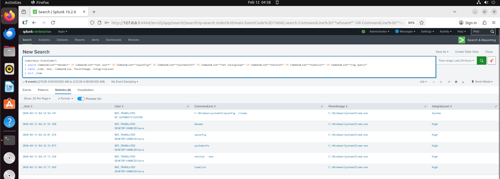
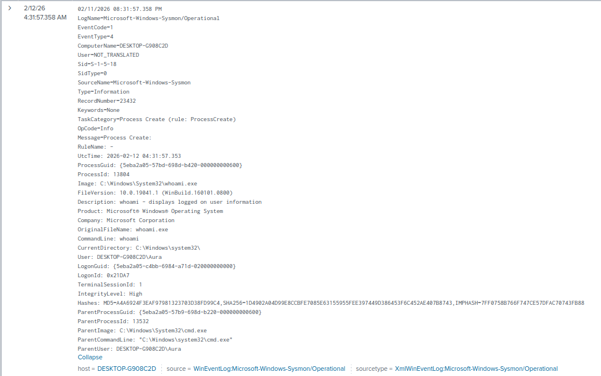

# Lab 1: Attacker Reconnaissance Detection

**Date:** 2026-02-11
**Analyst:** Vishva Teja Chikoti
**Environment:** Windows 10 VM | Sysmon | Splunk 10.2.0
**Difficulty:** Beginner

---

## Objective
Simulate post-exploitation reconnaissance commands and detect
them using Sysmon EventCode=1 (Process Create) in Splunk.

## NIST SP 800-61 Incident Response Phase
> **Phase 2: Detection & Analysis**
> Reconnaissance activity identified via process creation logs.
> Analyst confirmed dual-account foothold. Severity: HIGH.
---
## Analyst Narrative

While reviewing Sysmon logs in Splunk, I noticed a cluster of 
reconnaissance commands executed within a 21-minute window. 
What caught my attention wasn't any single command — it was 
the pattern.

First, NT AUTHORITY\SYSTEM ran ipconfig /renew at 04:16 AM. 
Fifteen minutes later, user "Aura" began manual recon from 
cmd.exe with elevated privileges. Two different accounts 
running network discovery commands in the same window 
suggested either privilege escalation or a dual foothold 
on the system.

My investigation focused on:
1. Correlating both accounts to the same session
2. Identifying the parent process chain
3. Determining if this was IT activity or attacker behavior
4. Building a detection rule to catch this pattern automatically

Key decision point: Individual commands like whoami or ipconfig 
are normal admin activity. The combination of 6+ commands, 
elevated privileges, off-hours timing, and two account types 
in 21 minutes = high confidence malicious recon.
## Attack Simulation

Commands executed on Windows VM:
```powershell
whoami
ipconfig
systeminfo
net user
net localgroup administrators
netstat -ano
tasklist
reg query HKLM\SOFTWARE\Microsoft\Windows\CurrentVersion\Run
```

**Why attackers run these:**
| Command | Attacker Purpose |
|---------|-----------------|
| whoami | Confirm user context |
| ipconfig | Map network layout |
| systeminfo | OS version, patch level |
| net user | List accounts to target |
| net localgroup administrators | Find admin accounts |
| netstat -ano | Spot active connections |
| tasklist | Detect AV/EDR processes |
| reg query | Find persistence paths |

---

## Detection

**Splunk Query:**
```
index=main EventCode=1
| search CommandLine="*whoami*" 
  OR CommandLine="*net user*" 
  OR CommandLine="*ipconfig*" 
  OR CommandLine="*systeminfo*" 
  OR CommandLine="*net localgroup*" 
  OR CommandLine="*netstat*" 
  OR CommandLine="*tasklist*" 
  OR CommandLine="*reg query*"
| table _time, User, CommandLine, ParentImage, IntegrityLevel
| sort _time
```

---

## Findings

**Timeline:** 04:16 AM - 04:37 AM (21 minute window)

| Time | User | Command | Integrity |
|------|------|---------|-----------|
| 04:16:54 | NT AUTHORITY\SYSTEM | ipconfig /renew | System |
| 04:31:57 | DESKTOP-G908C2D\Aura | whoami | High |
| 04:32:01 | DESKTOP-G908C2D\Aura | ipconfig | High |
| 04:32:23 | DESKTOP-G908C2D\Aura | systeminfo | High |
| 04:37:13 | DESKTOP-G908C2D\Aura | netstat -ano | High |
| 04:37:17 | DESKTOP-G908C2D\Aura | tasklist | High |

**Key Observations:**
- Two users involved: SYSTEM + Aura
- All commands spawned from cmd.exe
- IntegrityLevel: High = elevated privileges
- Commands within 21 min = scripted/manual recon session
- SYSTEM ran ipconfig 15 min before Aura = possible dual foothold

---

## MITRE ATT&CK Mapping

| Technique ID | Name | Command |
|-------------|------|---------|
| T1033 | System Owner/User Discovery | whoami |
| T1016 | System Network Configuration Discovery | ipconfig |
| T1082 | System Information Discovery | systeminfo |
| T1087 | Account Discovery | net user |
| T1049 | System Network Connections Discovery | netstat |
| T1057 | Process Discovery | tasklist |
| T1012 | Query Registry | reg query |

---

## Alert Rule Logic
```
IF same user runs 3+ recon commands
WITHIN 10 minute window
FROM cmd.exe OR powershell.exe
THEN → HIGH alert: Post-Exploitation Recon Detected
```

---

## False Positives

| Scenario | Mitigation |
|----------|------------|
| IT admin troubleshooting | Whitelist IT admin accounts |
| Helpdesk diagnostics | Whitelist during business hours |
| Automated monitoring scripts | Whitelist known script hashes |

---

## Screenshots



---

## Lessons Learned
- Individual recon commands = low signal
- Same user, multiple commands, short window = HIGH signal
- SYSTEM + user account recon together = escalation indicator
- Parent process matters: cmd.exe vs powershell.exe vs explorer.exe
```
