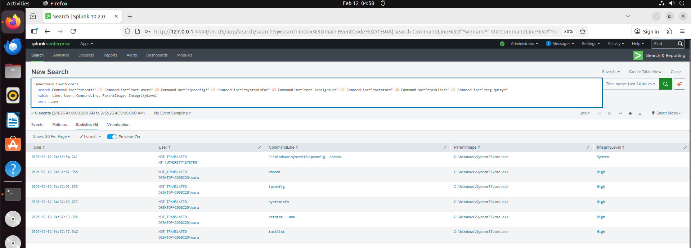
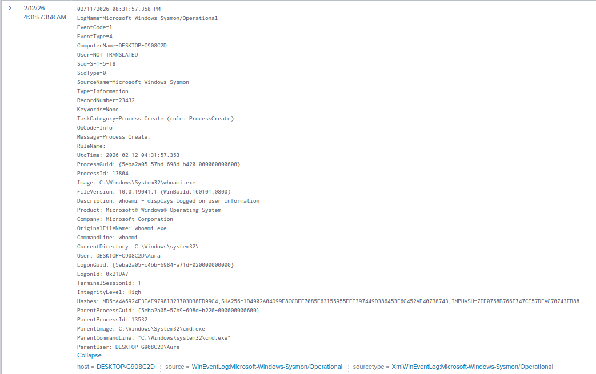

# Lab 1: Windows Discovery Command Detection

**Date:** 2026-02-11
**Analyst:** Vishva Teja Chikoti
**Environment:** Windows 10 VM | Sysmon | Splunk 10.2.0
**Difficulty:** Beginner
**Alert Priority:** HIGH when the activity is unapproved

---

## Objective

Simulate Windows discovery commands commonly observed during post-exploitation and detect them using Sysmon Event ID 1 process-creation telemetry in Splunk.

The investigation focuses on identifying a burst of multiple discovery techniques while distinguishing suspicious command sequences from ordinary administrative activity.

---

## NIST SP 800-61 Rev. 3 Alignment

This lab demonstrates incident detection, event analysis, evidence validation, prioritization, and response decision-making.

**Observed:** Multiple discovery commands were recorded through Sysmon process-creation events.

**Assessed:** The user-context sequence is consistent with a concentrated system-discovery burst.

**Not confirmed:** Process-creation events alone do not prove malicious intent, privilege escalation, or multiple attacker footholds.

---

## Analyst Narrative

While reviewing Sysmon Event ID 1 telemetry in Splunk, I identified multiple Windows discovery commands executed by user `DESKTOP-G908C2D\Aura` within approximately five minutes.

The user executed:

* `whoami`
* `ipconfig`
* `systeminfo`
* `netstat -ano`
* `tasklist`

The commands were launched from `cmd.exe` with a High integrity level. No individual command is inherently malicious, but several distinct discovery commands executed by the same user in a short period create a stronger behavioral signal.

A separate `ipconfig /renew` event was recorded under `NT AUTHORITY\SYSTEM` approximately 15 minutes earlier. This event was retained as contextual evidence but was not counted as part of the suspicious discovery burst because `/renew` is commonly associated with DHCP configuration maintenance.

### Analyst Assessment

**Observed:**

* Five discovery commands were executed by the same user.
* The commands occurred within approximately five minutes.
* The commands were launched from `cmd.exe`.
* The user processes had a High integrity level.
* A separate `SYSTEM`-context `ipconfig /renew` event occurred earlier.

**Assessed:**

* The user-context sequence is consistent with manual or automated discovery activity.
* The number of distinct discovery categories and short execution window justify investigation.
* High-integrity execution increases the potential impact of the activity.

**Not confirmed:**

* The `SYSTEM` and user events do not independently prove two attacker footholds.
* The evidence does not establish privilege escalation.
* The timing alone does not prove whether the commands were manually entered or executed by a script.
* Malicious intent requires correlation with user activity, parent processes, authentication events, network connections, and surrounding endpoint telemetry.

---

## Attack Simulation

The following commands were executed in the controlled Windows lab:

```powershell
whoami
ipconfig
systeminfo
net user
net localgroup administrators
netstat -ano
tasklist
reg query HKLM\SOFTWARE\Microsoft\Windows\CurrentVersion\Run
```

### Discovery Purpose

| Command                         | Information Collected                                        |
| ------------------------------- | ------------------------------------------------------------ |
| `whoami`                        | Current user and security context                            |
| `ipconfig`                      | Local IP address and network configuration                   |
| `systeminfo`                    | Operating-system, build, patch, and architecture details     |
| `net user`                      | Local account information                                    |
| `net localgroup administrators` | Members of the local Administrators group                    |
| `netstat -ano`                  | Active network connections, listening ports, and process IDs |
| `tasklist`                      | Running processes and installed security-tool indicators     |
| `reg query`                     | Registry configuration and possible persistence locations    |

> The simulation list shows the complete command set. The findings table below contains only the events represented in the available investigation evidence.

---

## Detection Requirements

* Sysmon Event ID 1 enabled
* Process command-line collection enabled
* Splunk ingestion of the Sysmon Operational log
* The following fields available or extracted:

  * `Image`
  * `CommandLine`
  * `User`
  * `ParentImage`
  * `IntegrityLevel`
  * `ProcessGuid`
  * `host`

---

## Detection Queries

### Query 1 — Discovery Command Hunt

```spl
index=endpoint EventCode=1
| eval image=lower(Image), command=lower(CommandLine)
| eval DiscoveryType=case(
    match(image, "\\\\whoami\.exe$"),
        "System Owner/User Discovery",
    match(image, "\\\\ipconfig\.exe$")
        AND NOT match(command, "\/(renew|release|flushdns|registerdns)(\s|$)"),
        "System Network Configuration Discovery",
    match(image, "\\\\systeminfo\.exe$"),
        "System Information Discovery",
    match(image, "\\\\net(1)?\.exe$")
        AND match(command, "\suser(\s|$)"),
        "Local Account Discovery",
    match(image, "\\\\net(1)?\.exe$")
        AND match(command, "\slocalgroup\s+administrators"),
        "Local Administrators Group Discovery",
    match(image, "\\\\netstat\.exe$"),
        "System Network Connections Discovery",
    match(image, "\\\\tasklist\.exe$"),
        "Process Discovery",
    match(image, "\\\\reg\.exe$")
        AND match(command, "\squery\s"),
        "Registry Query",
    true(),
        null()
)
| where isnotnull(DiscoveryType)
| table _time host User Image ParentImage CommandLine DiscoveryType IntegrityLevel ProcessGuid
| sort _time
```

This query classifies each process into a discovery category and excludes common `ipconfig` maintenance operations such as `/renew`, `/release`, and `/flushdns`.

---

### Query 2 — Discovery Burst Alert

```spl
index=endpoint EventCode=1
| eval image=lower(Image), command=lower(CommandLine)
| eval DiscoveryType=case(
    match(image, "\\\\whoami\.exe$"),
        "User Discovery",
    match(image, "\\\\ipconfig\.exe$")
        AND NOT match(command, "\/(renew|release|flushdns|registerdns)(\s|$)"),
        "Network Configuration",
    match(image, "\\\\systeminfo\.exe$"),
        "System Information",
    match(image, "\\\\net(1)?\.exe$")
        AND match(command, "\suser(\s|$)"),
        "Local Accounts",
    match(image, "\\\\net(1)?\.exe$")
        AND match(command, "\slocalgroup\s+administrators"),
        "Local Administrators",
    match(image, "\\\\netstat\.exe$"),
        "Network Connections",
    match(image, "\\\\tasklist\.exe$"),
        "Processes",
    match(image, "\\\\reg\.exe$")
        AND match(command, "\squery\s"),
        "Registry",
    true(),
        null()
)
| where isnotnull(DiscoveryType)
| bin _time span=10m
| stats
    count AS command_count
    dc(DiscoveryType) AS distinct_discovery_types
    values(DiscoveryType) AS discovery_types
    values(CommandLine) AS commands
    values(ParentImage) AS parent_processes
    values(IntegrityLevel) AS integrity_levels
    values(ProcessGuid) AS process_guids
    BY _time host User
| where command_count >= 3 AND distinct_discovery_types >= 3
| sort -_time
```

### Alert Interpretation

Trigger an alert when:

```text
The same user executes at least three discovery commands
covering at least three distinct discovery categories
on the same host within ten minutes.
```

Increase priority when one or more of the following are present:

* High or System integrity
* Unusual parent process
* Newly authenticated or rarely observed account
* Encoded or remotely delivered command execution
* Discovery followed by credential access or lateral movement
* Execution outside an approved administrative task
* Activity on a critical server or domain controller

---

## Findings

### Investigation Timeline

**User discovery burst:** 04:31:57–04:37:17
**Duration:** Approximately 5 minutes and 20 seconds

| Time     | User                   | Command           | Integrity | Classification                             |
| -------- | ---------------------- | ----------------- | --------- | ------------------------------------------ |
| 04:16:54 | `NT AUTHORITY\SYSTEM`  | `ipconfig /renew` | System    | Context event — likely network maintenance |
| 04:31:57 | `DESKTOP-G908C2D\Aura` | `whoami`          | High      | User discovery                             |
| 04:32:01 | `DESKTOP-G908C2D\Aura` | `ipconfig`        | High      | Network configuration discovery            |
| 04:32:23 | `DESKTOP-G908C2D\Aura` | `systeminfo`      | High      | System information discovery               |
| 04:37:13 | `DESKTOP-G908C2D\Aura` | `netstat -ano`    | High      | Network connections discovery              |
| 04:37:17 | `DESKTOP-G908C2D\Aura` | `tasklist`        | High      | Process discovery                          |

### Key Findings

* Five discovery commands were executed by the same user.
* The five user commands occurred within approximately five minutes.
* At least five distinct discovery categories were represented.
* The commands were launched from `cmd.exe`.
* The user-context processes ran with High integrity.
* The earlier `SYSTEM` event used `ipconfig /renew` and was excluded from the discovery-burst count.
* No evidence in this dataset independently confirms privilege escalation or separate attacker footholds.

---

## MITRE ATT&CK Mapping

| Technique ID | Technique                                 | Evidence                        |
| ------------ | ----------------------------------------- | ------------------------------- |
| T1033        | System Owner/User Discovery               | `whoami`                        |
| T1016        | System Network Configuration Discovery    | `ipconfig`                      |
| T1082        | System Information Discovery              | `systeminfo`                    |
| T1087.001    | Account Discovery: Local Account          | `net user`                      |
| T1069.001    | Permission Groups Discovery: Local Groups | `net localgroup administrators` |
| T1049        | System Network Connections Discovery      | `netstat -ano`                  |
| T1057        | Process Discovery                         | `tasklist`                      |
| T1012        | Query Registry                            | `reg query`                     |

---

## Severity and Verdict

### Alert Priority

**HIGH** when the discovery burst is unapproved, elevated, and inconsistent with the user's normal responsibilities.

### Lab Verdict

**Confirmed:** The controlled simulation generated multiple Windows discovery commands.

**High confidence:** The `Aura` account executed a concentrated discovery sequence.

**Not confirmed:** The available evidence does not independently establish an attacker foothold, privilege escalation, or malicious intent outside the controlled simulation.

In a production environment, the alert should remain open until the analyst validates:

* The user's role and expected activity
* Change tickets or troubleshooting activity
* Parent and grandparent process lineage
* Authentication events preceding the commands
* Network connections following the commands
* PowerShell, script, or remote-management activity
* Related credential-access, persistence, or lateral-movement telemetry

---

## False Positives and Tuning

| Legitimate Scenario                  | Validation and Tuning                                                                     |
| ------------------------------------ | ----------------------------------------------------------------------------------------- |
| IT administrator troubleshooting     | Verify the account, host, ticket, command sequence, and approved time window              |
| Helpdesk diagnostic session          | Confirm an active support case and expected remote-management process                     |
| Inventory or monitoring script       | Baseline the script path, signer, hash, service account, and parent process               |
| Software deployment workflow         | Validate the deployment platform, package, and change record                              |
| User troubleshooting a network issue | Review whether the commands and account behavior match normal user activity               |
| DHCP or network maintenance          | Exclude specific operations such as `ipconfig /renew` rather than all `ipconfig` activity |

Avoid allowlisting an entire administrator account. Tune narrowly using combinations of:

* User
* Host
* Parent process
* Script or executable hash
* Digital signature
* Command-line arguments
* Approved time window
* Change-ticket identifier

---

## Recommended Analyst Actions

1. Confirm whether the account owner initiated the commands.
2. Review the complete process tree and Process GUID relationships.
3. Check authentication events immediately before the discovery burst.
4. Search for PowerShell, WMI, PsExec, RDP, scheduled-task, or remote-management activity.
5. Review network connections created after the discovery sequence.
6. Search for credential-access, persistence, and lateral-movement indicators.
7. Compare the behavior with the account and endpoint baseline.
8. Escalate when the activity is unexplained or correlated with additional malicious evidence.

---

## Screenshots




---

## Lessons Learned

1. Individual discovery commands are usually low-signal events.
2. Multiple distinct discovery commands from one user in a short window create a stronger behavioral detection.
3. High integrity increases risk but does not independently prove maliciousness.
4. `ipconfig /renew` should not automatically be treated as attacker reconnaissance.
5. SYSTEM and user activity in the same time window does not prove two attacker footholds.
6. Parent process, command line, user context, Process GUID, timing, and follow-on behavior should be analyzed together.
7. Broad account allowlists can hide real attacks; narrow evidence-based tuning is safer.
8. Analyst reports should clearly distinguish observed evidence, assessment, and unconfirmed hypotheses.
