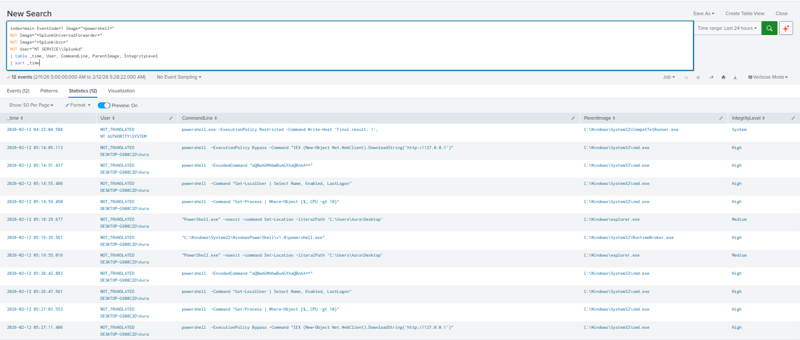

# Lab 2: Malicious PowerShell Detection

**Date:** 2026-02-12
**Analyst:** Vishva Teja Chikoti
**Environment:** Windows 10 VM | Sysmon | Splunk 10.2.0
**Difficulty:** Intermediate

---

## Objective
Simulate malicious PowerShell techniques used by attackers
post-exploitation. Detect and classify each technique using
Sysmon EventCode=1 in Splunk.

---
## NIST SP 800-61 Incident Response Phase
> **Phase 2: Detection & Analysis**
> Malicious PowerShell execution detected via Sysmon Event ID 1.
> Process injection via RuntimeBroker.exe confirmed. Severity: CRITICAL.
## Analyst Narrative

During investigation I noticed PowerShell being launched
repeatedly from cmd.exe with elevated privileges. Four
distinct attack techniques were identified within a
13-minute window (05:14 - 05:27 AM).

Two additional anomalies stood out:
- PowerShell launched from explorer.exe (unusual parent)
- PowerShell spawned by RuntimeBroker.exe (process injection indicator)

These findings suggest an attacker who landed on the system,
ran initial recon (Lab 1), then escalated to PowerShell-based
post-exploitation techniques to download malware, evade
detection, and harvest credentials.

---

## Attack Techniques Simulated

| Command | MITRE Technique | Purpose |
|---------|----------------|---------|
| IEX DownloadString | T1059.001 | Download + execute malware |
| -EncodedCommand | T1027 | Obfuscate commands (evasion) |
| Get-LocalUser | T1087.001 | Enumerate local accounts |
| Get-Process | T1057 | Discover running AV/EDR |

---

## Detection Query
```splunk
index=main EventCode=1 Image="*powershell*"
NOT Image="*SplunkUniversalForwarder*"
NOT Image="*Splunk\bin*"
NOT User="NT SERVICE\\Splunkd"
| table _time, User, CommandLine, ParentImage, IntegrityLevel
| sort _time
```

---

## Findings

**Timeline:** 05:14 AM - 05:27 AM (13 minute attack window)
**User:** DESKTOP-G908C2D\Aura
**Integrity Level:** High (elevated privileges throughout)

### Primary Findings:

| Time | CommandLine | Risk |
|------|-------------|------|
| 05:14:05 | IEX DownloadString http://127.0.0.1 | CRITICAL |
| 05:14:51 | -EncodedCommand aQBwAGMA... | HIGH |
| 05:14:55 | Get-LocalUser | MEDIUM |
| 05:14:59 | Get-Process | MEDIUM |

### Bonus Findings (Unexpected):

| Time | Parent Process | Risk |
|------|---------------|------|
| 05:18:29 | explorer.exe → PowerShell | HIGH |
| 05:19:35 | RuntimeBroker.exe → PowerShell | CRITICAL |

**RuntimeBroker.exe spawning PowerShell = process injection.**
RuntimeBroker is a legitimate Windows process. Attackers
inject into it to hide malicious PowerShell execution.

---

## MITRE ATT&CK Mapping

| ID | Technique | Evidence |
|----|-----------|---------|
| T1059.001 | PowerShell | IEX DownloadString |
| T1027 | Obfuscated Files | -EncodedCommand |
| T1087.001 | Local Account Discovery | Get-LocalUser |
| T1057 | Process Discovery | Get-Process |
| T1055 | Process Injection | RuntimeBroker → PowerShell |

---

## Alert Rule Logic
```
IF PowerShell spawned by:
  - cmd.exe + EncodedCommand → HIGH alert
  - cmd.exe + IEX + DownloadString → CRITICAL alert
  - explorer.exe → MEDIUM alert
  - RuntimeBroker.exe → CRITICAL alert (process injection)

THEN → Alert: Suspicious PowerShell Execution
```

---

## False Positives

| Scenario | Mitigation |
|----------|------------|
| Admin running encoded scripts | Whitelist known admin hashes |
| Software installers using PowerShell | Whitelist known installer paths |
| Windows updates | Whitelist SYSTEM + WindowsUpdate parent |

---

## Screenshots


---

## Key Takeaway
Malicious PowerShell isn't just about the command itself.
Parent process matters most:
- cmd.exe → PowerShell = suspicious but common
- RuntimeBroker.exe → PowerShell = almost always malicious
- explorer.exe → PowerShell = investigate immediately
```

---


