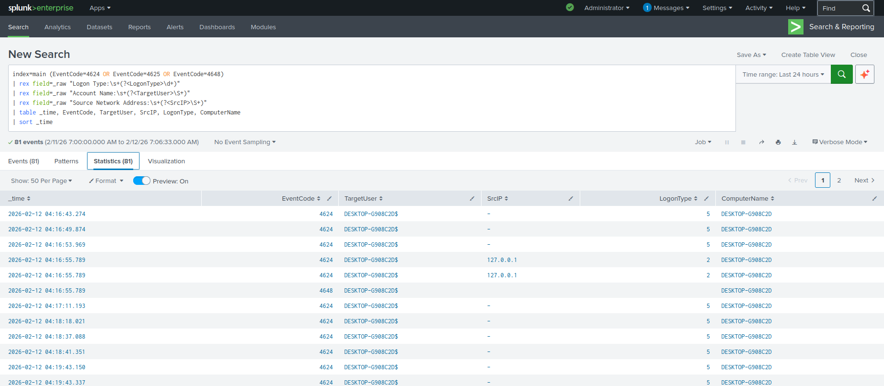

# Lab 5: RDP Authentication and Explicit Credential Use Detection

**Date:** 2026-02-12  
**Analyst:** Vishva Teja Chikoti  
**Severity:** HIGH  
**Difficulty:** Intermediate

---

## Objective

Simulate explicit credential use via stored Windows credentials and RDP. Detect authentication events using Windows Security logs in Splunk. Practice identifying suspicious credential patterns using Event ID correlation and logon type analysis.

> **Lab scope note:** This lab demonstrates local RDP authentication and explicit credential use on a single machine (127.0.0.1). It does not demonstrate lateral movement between hosts. For host-to-host lateral movement, see the enterprise AD lab SIM-007 (SMB Admin Share access from Kali Linux).

---

## NIST SP 800-61 Incident Response Phase

> **Phase 2: Detection & Analysis**  
> Explicit credential use detected (Event ID 4648) correlated with interactive logon (Event ID 4624 LogonType 2).  
> Stored credential enumeration via cmdkey observed.  
> Severity: HIGH. Scope: single host — no inter-host movement confirmed.

---

## Lab Setup

| Component | Detail |
|-----------|--------|
| Environment | Windows 10 VM |
| Data Source | Windows Security Event Logs |
| Tools Used | Splunk 10.2.0, cmdkey, mstsc |
| Key Event IDs | 4624, 4625, 4648 |
| Splunk Index | wineventlog |

---

## Analyst Narrative

During investigation of authentication logs, I identified a notable sequence at 04:16:55 AM: two interactive logins from 127.0.0.1 (LogonType 2) immediately followed by Event ID 4648 (explicit credential use) at the same timestamp.

This pattern is consistent with an attacker who:
1. Enumerated stored credentials via `cmdkey /list`
2. Used those stored credentials explicitly to authenticate
3. Initiated an RDP session to localhost (127.0.0.1)

**Important:** Event ID 4648 records explicit credential use. It fires whenever credentials are passed explicitly rather than using the current session token. This includes legitimate scenarios such as `runas`, scheduled tasks, administrative tools, mapped network drives, and remote management software. The event is a useful investigation signal but must be correlated with the process, account, target server, source host, logon type, and surrounding authentication events before drawing conclusions.

The value of this lab is demonstrating how to isolate 3 suspicious events from 81 total — the noise reduction problem SOC analysts face daily.

---

## Attack Simulation

```cmd
REM Enumerate stored credentials
cmdkey /list

REM Enable RDP on this machine
reg add "HKLM\SYSTEM\CurrentControlSet\Control\Terminal Server" /v fDenyTSConnections /t REG_DWORD /d 0 /f

REM Connect to localhost via RDP using stored credentials
mstsc /v:127.0.0.1
```

**What cmdkey /list revealed:**

```
Target: WindowsLive:target=virtualapp/didlogical
Type:   Generic
User:   02eafqtbefhzxohn
```

**Analyst note on cmdkey:** `cmdkey /list` reveals stored credential **targets and usernames** — it does not display passwords in plaintext. Credentials stored in Windows Credential Manager are protected by the operating system and are not directly readable from the cmdkey output. An attacker with access to the user context may be able to leverage these stored credentials through Windows authentication mechanisms without needing to recover the plaintext password.

---

## Detection Queries

### Primary — Authentication Event Correlation

```spl
index=wineventlog source="WinEventLog:Security"
(EventCode=4624 OR EventCode=4625 OR EventCode=4648)
| rex field=_raw "Logon Type:\s+(?<LogonType>\d+)"
| rex field=_raw "Account Name:\s+(?<TargetUser>\S+)"
| rex field=_raw "Source Network Address:\s+(?<SrcIP>\S+)"
| table _time, EventCode, TargetUser, SrcIP, LogonType, ComputerName
| sort _time
```

### Explicit Credential Use Alert

```spl
index=wineventlog source="WinEventLog:Security"
EventCode=4648
| rex field=_raw "Account Name:\s+(?<TargetUser>\S+)"
| rex field=_raw "Target Server Name:\s+(?<TargetServer>\S+)"
| rex field=_raw "Process Name:\s+(?<ProcessName>[^\r\n]+)"
| table _time, TargetUser, TargetServer, ProcessName, ComputerName
| sort _time
```

**Note:** Always include `ProcessName` when investigating 4648 — it reveals which process passed the explicit credentials and is critical for distinguishing legitimate from suspicious use.

### RDP-Specific Detection (LogonType 10)

```spl
index=wineventlog source="WinEventLog:Security"
EventCode=4624
| rex field=_raw "Logon Type:\s+(?<LogonType>\d+)"
| rex field=_raw "Account Name:\s+(?<TargetUser>\S+)"
| rex field=_raw "Source Network Address:\s+(?<SrcIP>\S+)"
| where LogonType=10
| table _time, TargetUser, SrcIP, ComputerName
| sort _time
```

---

## Findings

**Total Events:** 81 authentication events  
**Timeframe:** 04:16:43 - 07:06:33 AM  
**Events warranting investigation:** 3

### Suspicious Event Sequence

| Time | EventCode | LogonType | SrcIP | Analyst Assessment |
|------|-----------|-----------|-------|-------------------|
| 04:16:55 | 4624 | 2 | 127.0.0.1 | Interactive logon from loopback — investigate |
| 04:16:55 | 4624 | 2 | 127.0.0.1 | Duplicate session token — correlated with above |
| 04:16:55 | 4648 | — | — | Explicit credential use — correlate with process and target |

### Noise vs Signal

| LogonType | Count | Classification |
|-----------|-------|---------------|
| 5 (Service) | 78 | ✅ Normal service logons — low priority |
| 2 (Interactive) from 127.0.0.1 | 2 | ⚠️ Investigate — loopback interactive logon |
| 4648 (Explicit credentials) | 1 | ⚠️ Investigate — correlate process and target server |

---

## EventCode Reference

| EventCode | Meaning | SOC Relevance |
|-----------|---------|---------------|
| 4624 | Successful logon | Always check LogonType |
| 4625 | Failed logon | Brute force / wrong creds indicator |
| 4648 | Explicit credential logon | Investigate — can be legitimate |
| LogonType 2 | Interactive | Local console or local RDP |
| LogonType 5 | Service | Normal — low priority |
| LogonType 10 | RemoteInteractive | RDP from remote host |

---

## MITRE ATT&CK Mapping

| ID | Technique | Evidence | Confidence |
|----|-----------|---------|-----------|
| T1021.001 | Remote Services: RDP | mstsc /v:127.0.0.1 observed — local only | Confirmed (local scope) |
| T1078 | Valid Accounts | Stored credential used for authentication | Confirmed |

**Removed from mapping:**
- ~~T1550.002 Pass-the-Hash~~ — not demonstrated. cmdkey uses stored credentials via Windows Credential Manager, not an NTLM hash. Pass-the-Hash requires authenticating with a raw hash without the plaintext password — a different mechanism entirely.
- ~~T1552.001 Credentials in Files~~ — cmdkey stores credentials in Windows Credential Manager, not in files on disk.
- ~~T1076 RDP Hijacking~~ — deprecated technique ID. Not demonstrated in this lab.

---

## Alert Rule Logic

```
IF EventCode=4648
AND ProcessName NOT IN known-legitimate-processes
AND TargetServer NOT IN known-admin-targets
THEN → MEDIUM: Explicit Credential Use — Investigate

IF EventCode=4648
AND followed by EventCode=4624 LogonType=10
WITHIN 60 seconds
AND TargetServer is a remote host (not localhost)
THEN → HIGH: Explicit Credential Use Preceding RDP Session

IF EventCode=4624 LogonType=2
AND SrcIP IN (127.0.0.1, ::1)
AND NOT known_admin_account
THEN → MEDIUM: Interactive Logon from Localhost — Investigate
```

---

## Risk Rating

**HIGH** — within the scope of this single host

| Factor | Assessment |
|--------|-----------|
| Stored credential enumeration observed | HIGH |
| Explicit credential use (4648) correlated with RDP | HIGH |
| Scope limited to single host | Reduces overall impact vs. cross-host movement |
| No confirmed inter-host lateral movement | Not demonstrated in this lab |

---

## Containment Actions

```
1. Identify all systems where this user has stored credentials (cmdkey /list)
2. Clear Windows Credential Manager on affected host
3. Check for 4648 events across the network — not just this host
4. Check for LogonType 10 (RDP) sessions to other hosts from this machine
5. Disable RDP if not required for business operations
6. Reset credentials for affected accounts
7. Escalate to L2 for full forensic investigation if scope extends beyond this host
```

---

## False Positives

| Scenario | Why 4648 Fires | Mitigation |
|----------|---------------|------------|
| Admin using runas | Explicit credential passed | Whitelist known admin accounts |
| Service account authentication | Stored service credentials | Whitelist known service account 4648 events |
| Remote management tools (PSExec, RMM) | Tool passes credentials explicitly | Whitelist known IT management processes and IPs |
| Scheduled tasks with explicit credentials | Task scheduler passes stored creds | Whitelist SYSTEM-context scheduled task processes |
| Mapped network drives | Drive mapping passes stored creds | Baseline normal mapping behavior per host |

---

## Screenshots



---

## Lessons Learned

1. **Event ID 4648 is a useful signal — not an automatic red flag.** It records explicit credential use, which can be legitimate. Always correlate with the process name, target server, account, and logon type before drawing conclusions.
2. **cmdkey /list reveals targets and usernames — not plaintext passwords.** Credentials are managed by Windows Credential Manager. An attacker may leverage stored credentials through Windows authentication without directly recovering the password.
3. **127.0.0.1 as RDP target is not lateral movement.** No inter-host movement occurred. This lab demonstrates local credential use and RDP authentication telemetry — valuable for understanding the events, not for claiming host pivoting.
4. **81 events, 3 suspicious — noise reduction is the real skill.** LogonType filtering (ignoring Type 5 service logons) is what makes the signal visible.
5. **LogonType matters more than EventCode alone.** Type 5 = low priority. Type 2 from loopback = investigate. Type 10 from a remote IP = high priority.
6. **Process name in 4648 is critical.** Without it, you cannot distinguish a legitimate runas from credential abuse.