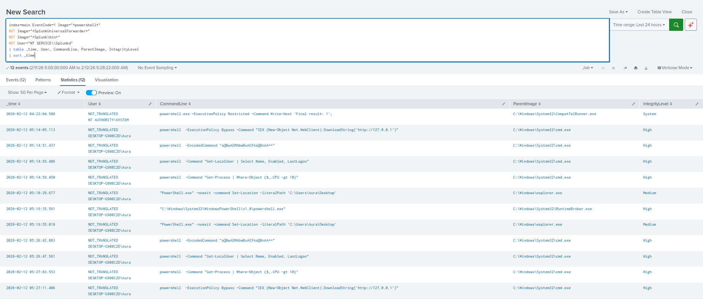
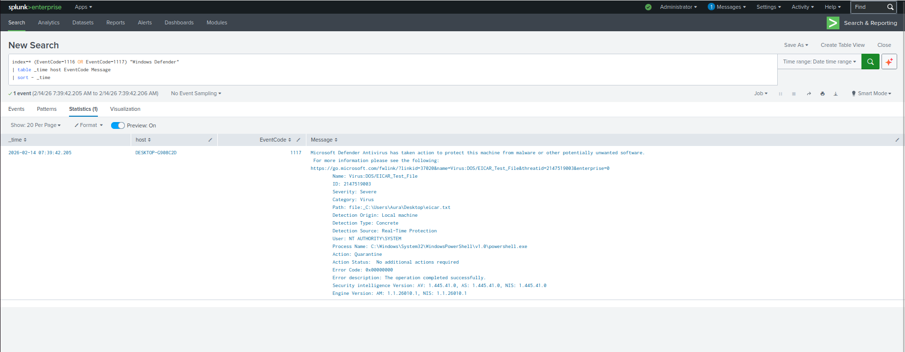

# Lab 2: Suspicious PowerShell Execution Detection

**Date:** 2026-02-12
**Analyst:** Vishva Teja Chikoti
**Environment:** Windows 10 VM | Sysmon | Splunk 10.2.0
**Difficulty:** Intermediate
**Alert Priority:** HIGH

---

## Objective

Simulate suspicious PowerShell techniques commonly observed during post-exploitation and detect them using Sysmon Event ID 1 process-creation telemetry in Splunk.

The investigation focuses on:

* Encoded PowerShell execution
* Download-and-execute behavior
* Account and process discovery
* Unusual PowerShell parent-child relationships
* Correlation between SIEM and Windows Defender telemetry

---

## NIST SP 800-61 Alignment

This lab demonstrates detection, analysis, evidence correlation, containment validation, and escalation decision-making.

**Observed:** Suspicious PowerShell command lines and unusual process relationships were recorded through Sysmon Event ID 1.

**Assessed:** The activity is consistent with suspicious PowerShell-based post-exploitation behavior.

**Not confirmed:** The `RuntimeBroker.exe → powershell.exe` relationship does not independently prove process injection.

---

## Analyst Narrative

During the investigation, I identified several PowerShell executions within a 13-minute window from 05:14 AM to 05:27 AM.

The command lines included:

* `IEX` with `DownloadString`
* `-EncodedCommand`
* `Get-LocalUser`
* `Get-Process`

These commands represent multiple suspicious behaviors, including remote-content retrieval, command obfuscation, account discovery, and process discovery.

Two unusual parent-child relationships were also observed:

* `explorer.exe → powershell.exe`
* `RuntimeBroker.exe → powershell.exe`

These relationships warrant investigation, but the parent-child relationship alone is not sufficient to confirm process injection.

### Analyst Assessment

**Observed:**

* PowerShell executed with High integrity.
* An encoded PowerShell command was recorded.
* `IEX DownloadString` was present in a command line.
* Account and process-discovery commands were executed.
* `explorer.exe` and `RuntimeBroker.exe` appeared as PowerShell parent processes.
* Windows Defender recorded and quarantined an EICAR test file.

**Assessed:**

* The PowerShell command-line activity is suspicious and consistent with techniques commonly used during post-exploitation.
* The RuntimeBroker parent relationship may indicate trusted-process abuse, parent-process spoofing, injected execution, unusual application behavior, or a laboratory artifact.
* The Defender event confirms that the test file was detected and contained.

**Not confirmed:**

* Process injection was not confirmed.
* The RuntimeBroker relationship does not by itself establish T1055.
* The evidence does not prove that an external attacker gained access to the system.
* The EICAR event confirms antivirus detection behavior, not the execution of real malware.
* The relationship between every PowerShell event and the Defender event must be validated using timestamps, process identifiers, and file evidence.

### Additional Evidence Required to Confirm Process Injection

Confirmation of process injection would require one or more of the following:

* Sysmon Event ID 8 — `CreateRemoteThread`
* Sysmon Event ID 10 — `ProcessAccess`
* EDR process-injection telemetry
* Suspicious memory regions or thread-start addresses
* API evidence such as:

  * `VirtualAllocEx`
  * `WriteProcessMemory`
  * `CreateRemoteThread`
* Memory-forensics evidence
* Process GUID or PID correlation supporting injected execution

---

## Attack Techniques Simulated

| Command or Behavior       | MITRE ATT&CK Technique                              | Purpose                                         |
| ------------------------- | --------------------------------------------------- | ----------------------------------------------- |
| `IEX DownloadString`      | T1059.001 — PowerShell                              | Retrieve and execute content through PowerShell |
| `-EncodedCommand`         | T1027 — Obfuscated/Compressed Files and Information | Obfuscate command content                       |
| `Get-LocalUser`           | T1087.001 — Local Account Discovery                 | Enumerate local user accounts                   |
| `Get-Process`             | T1057 — Process Discovery                           | Enumerate running processes                     |
| Unusual PowerShell parent | Investigation lead only                             | Identify potentially abnormal execution context |

---

## Data Requirements

* Sysmon Event ID 1 enabled
* Process command-line logging enabled
* Sysmon Operational logs ingested into Splunk
* The following fields available or extracted:

  * `Image`
  * `CommandLine`
  * `ParentImage`
  * `User`
  * `IntegrityLevel`
  * `ProcessId`
  * `ProcessGuid`
  * `ParentProcessId`
  * `ParentProcessGuid`
  * `host`

---

## Detection Queries

### Query 1 — Suspicious PowerShell Behavior

```spl
index=endpoint EventCode=1
(Image="*\\powershell.exe" OR Image="*\\pwsh.exe")
| eval suspicious_behavior=case(
    match(CommandLine, "(?i)(^|\s)-enc(odedcommand)?(\s|$)"),
        "Encoded PowerShell",
    match(CommandLine, "(?i)invoke-expression|\biex\b"),
        "Dynamic command execution",
    match(CommandLine, "(?i)downloadstring|downloadfile|invoke-webrequest|\biwr\b"),
        "Download activity",
    match(CommandLine, "(?i)executionpolicy\s+bypass"),
        "Execution-policy bypass",
    match(CommandLine, "(?i)windowstyle\s+hidden"),
        "Hidden PowerShell execution",
    match(CommandLine, "(?i)get-localuser"),
        "Local account discovery",
    match(CommandLine, "(?i)get-process"),
        "Process discovery",
    true(),
        null()
)
| where isnotnull(suspicious_behavior)
| table _time host User Image ParentImage CommandLine suspicious_behavior IntegrityLevel ProcessId ProcessGuid ParentProcessId ParentProcessGuid
| sort _time
```

---

### Query 2 — Unusual PowerShell Parent Processes

```spl
index=endpoint EventCode=1
(Image="*\\powershell.exe" OR Image="*\\pwsh.exe")
| eval parent_name=lower(replace(ParentImage, "^.*\\\\", ""))
| where parent_name IN (
    "runtimebroker.exe",
    "winword.exe",
    "excel.exe",
    "outlook.exe",
    "mshta.exe",
    "wscript.exe",
    "cscript.exe",
    "rundll32.exe",
    "regsvr32.exe"
)
| table _time host User ParentImage Image CommandLine IntegrityLevel ProcessGuid ParentProcessGuid
| sort _time
```

An unusual parent process increases suspicion but does not prove process injection.

---

### Query 3 — Potential Injection-Supporting Telemetry

```spl
index=endpoint sourcetype="XmlWinEventLog:Microsoft-Windows-Sysmon/Operational"
(EventCode=8 OR EventCode=10)
(TargetImage="*\\RuntimeBroker.exe" OR SourceImage="*\\RuntimeBroker.exe"
 OR TargetImage="*\\powershell.exe" OR SourceImage="*\\powershell.exe")
| table _time host EventCode SourceImage TargetImage SourceProcessId TargetProcessId GrantedAccess StartAddress StartModule CallTrace
| sort _time
```

This query should be used to search for supporting evidence. A result still requires analyst validation before classifying the activity as process injection.

---

## Findings

**Investigation window:** 05:14 AM–05:27 AM
**Duration:** Approximately 13 minutes
**User:** `DESKTOP-G908C2D\Aura`
**Integrity Level:** High

### Primary Findings

| Time     | Command Line                          | Assessment                               | Confidence |
| -------- | ------------------------------------- | ---------------------------------------- | ---------- |
| 05:14:05 | `IEX DownloadString http://127.0.0.1` | Suspicious download-and-execute behavior | High       |
| 05:14:51 | `-EncodedCommand aQBwAGMA...`         | Obfuscated PowerShell execution          | High       |
| 05:14:55 | `Get-LocalUser`                       | Local account discovery                  | High       |
| 05:14:59 | `Get-Process`                         | Process discovery                        | High       |

The loopback destination `127.0.0.1` indicates that the content source was on the same host. It demonstrates the command behavior but does not establish external command-and-control communication.

### Additional Process-Tree Findings

| Time     | Parent-Child Relationship            | Assessment                                                                            | Confidence    |
| -------- | ------------------------------------ | ------------------------------------------------------------------------------------- | ------------- |
| 05:18:29 | `explorer.exe → powershell.exe`      | May result from interactive user execution; investigate command line and user context | Low to Medium |
| 05:19:35 | `RuntimeBroker.exe → powershell.exe` | Anomalous relationship requiring additional telemetry                                 | Medium        |

### Process-Injection Assessment

`RuntimeBroker.exe → powershell.exe` is an anomalous parent-child relationship.

Possible explanations include:

* Trusted-process abuse
* Parent PID spoofing
* Process injection
* Application or operating-system behavior
* Incorrect or incomplete telemetry
* Controlled-lab artifacts

**Verdict:** Suspicious relationship observed. Process injection was not confirmed.

---

## MITRE ATT&CK Mapping

| Technique ID | Technique                                     | Evidence                                      | Status        |
| ------------ | --------------------------------------------- | --------------------------------------------- | ------------- |
| T1059.001    | Command and Scripting Interpreter: PowerShell | PowerShell process and command-line telemetry | Confirmed     |
| T1027        | Obfuscated/Compressed Files and Information   | `-EncodedCommand`                             | Confirmed     |
| T1087.001    | Account Discovery: Local Account              | `Get-LocalUser`                               | Confirmed     |
| T1057        | Process Discovery                             | `Get-Process`                                 | Confirmed     |
| T1055        | Process Injection                             | RuntimeBroker parent relationship only        | Not confirmed |

T1055 is retained as an investigation hypothesis, not as a validated technique.

---

## Alert Rule Logic

```text
IF PowerShell contains EncodedCommand
THEN HIGH: Encoded PowerShell execution

IF PowerShell contains IEX or Invoke-Expression
AND contains DownloadString, DownloadFile, or Invoke-WebRequest
THEN HIGH: PowerShell download-and-execute behavior

IF PowerShell executes account or process discovery commands
AND occurs with other suspicious PowerShell behavior
THEN increase alert confidence

IF PowerShell has an unusual parent such as RuntimeBroker.exe
THEN MEDIUM: Anomalous PowerShell parent-child relationship

DO NOT classify the event as process injection
unless injection-specific telemetry supports that conclusion
```

---

## False Positives and Tuning

| Legitimate Scenario                   | Validation and Tuning                                                                              |
| ------------------------------------- | -------------------------------------------------------------------------------------------------- |
| Administrator running encoded scripts | Validate approved script, signer, hash, account, host, and change ticket                           |
| Software deployment using PowerShell  | Baseline deployment platform, package path, signer, and parent process                             |
| Security or management tooling        | Confirm approved agent, service account, binary signature, and expected command                    |
| Interactive troubleshooting           | Validate user intent, ticket, execution time, and endpoint role                                    |
| PowerShell launched from Explorer     | Review whether the user manually opened a script or terminal                                       |
| Internal test activity                | Tag known lab users, systems, commands, and time windows without globally suppressing the behavior |

Avoid allowlisting entire administrator accounts or all PowerShell launched by a specific parent. Use narrow combinations of:

* User
* Host
* Parent process
* Command line
* Script hash
* Digital signature
* Change window
* Process GUID
* Known management system

---

## Windows Defender Correlation

**Event Source:** `WinEventLog:Microsoft-Windows-Windows Defender/Operational`

| Field            | Value                              |
| ---------------- | ---------------------------------- |
| Event ID         | 1117 — Malware Action Taken        |
| Threat Name      | `Virus:DOS/EICAR_Test_File`        |
| Severity         | Severe                             |
| Category         | Virus                              |
| File Path        | `C:\Users\Public\test-malware.txt` |
| Detection Origin | Local Machine                      |
| Detection Source | Real-Time Protection               |
| Process          | `powershell.exe`                   |
| User             | `NT AUTHORITY\SYSTEM`              |
| Action           | Quarantine                         |
| Action Status    | No additional actions required     |

### Defender Detection Query

```spl
index=wineventlog source="WinEventLog:Microsoft-Windows-Windows Defender/Operational"
(EventCode=1116 OR EventCode=1117)
| table _time host EventCode Message
| sort -_time
```

---

## SIEM and Endpoint Correlation

| Source                 | Signal                                   | Assessment                      | Confidence    |
| ---------------------- | ---------------------------------------- | ------------------------------- | ------------- |
| Sysmon Event ID 1      | Suspicious PowerShell command lines      | Directly observed               | High          |
| Sysmon process tree    | RuntimeBroker-to-PowerShell relationship | Anomalous; requires validation  | Medium        |
| Defender Event ID 1117 | EICAR test file detected and quarantined | Confirmed test-file containment | Confirmed     |
| Sysmon Event IDs 8/10  | Injection-supporting telemetry           | Not shown in available evidence | Not confirmed |

### Correlation Limitations

The Defender event confirms that the EICAR test file was detected and quarantined. It does not independently confirm:

* Process injection
* Real malware execution
* External compromise
* Command-and-control communication
* Credential harvesting

The analyst should compare:

* Event timestamps
* Process IDs
* Process GUIDs
* User context
* File path
* PowerShell command line
* Defender detection details

before concluding that all events belong to one execution chain.

---

## Analyst Verdict

**Confirmed:**

* Suspicious PowerShell command lines were executed.
* Encoded PowerShell was observed.
* Account and process-discovery commands were observed.
* Defender detected and quarantined the EICAR test file.

**Assessed:**

* The command sequence is consistent with suspicious PowerShell-based post-exploitation behavior.
* The RuntimeBroker parent relationship requires further investigation.

**Not confirmed:**

* Process injection
* External attacker access
* Real malware execution
* Credential harvesting
* External command-and-control traffic

### Alert Priority

**HIGH**

The alert should be escalated when the activity is not associated with an approved test, administrative task, or software-management workflow.

---

## Containment and Response

Defender quarantined the EICAR test file. This confirms containment of that specific test artifact.

In a production incident, additional actions may include:

1. Validate whether the activity was authorized.
2. Review the full process tree and process GUID relationships.
3. Search Sysmon Event IDs 8 and 10 for injection-supporting telemetry.
4. Review PowerShell Script Block Logging Event ID 4104.
5. Search Sysmon Event ID 3 and proxy logs for network connections.
6. Inspect downloaded files and calculate hashes.
7. Review authentication and privilege events associated with the user.
8. Isolate the endpoint when malicious activity is supported by additional evidence.
9. Preserve volatile evidence before terminating processes.
10. Escalate to incident response when scope or maliciousness remains unresolved.

Do not state that “no manual containment is required” solely because one file was quarantined. Other processes, files, credentials, or persistence mechanisms may still require investigation.

---

## Screenshots






---

## Lessons Learned

1. PowerShell itself is not malicious; command-line behavior and context determine risk.
2. Encoded commands and download-and-execute patterns create stronger detection signals.
3. Parent-child relationships are investigation leads, not automatic proof of injection.
4. `explorer.exe → powershell.exe` may result from normal interactive execution.
5. `RuntimeBroker.exe → powershell.exe` is anomalous but requires supporting telemetry.
6. T1055 should not be marked confirmed without injection-specific evidence.
7. EICAR validates antivirus detection and quarantine behavior; it is not real malware.
8. SIEM and endpoint telemetry must be correlated by time, process, user, and artifact.
9. Broad PowerShell allowlists create dangerous detection gaps.
10. Analyst conclusions should distinguish observed, assessed, and unconfirmed findings.
