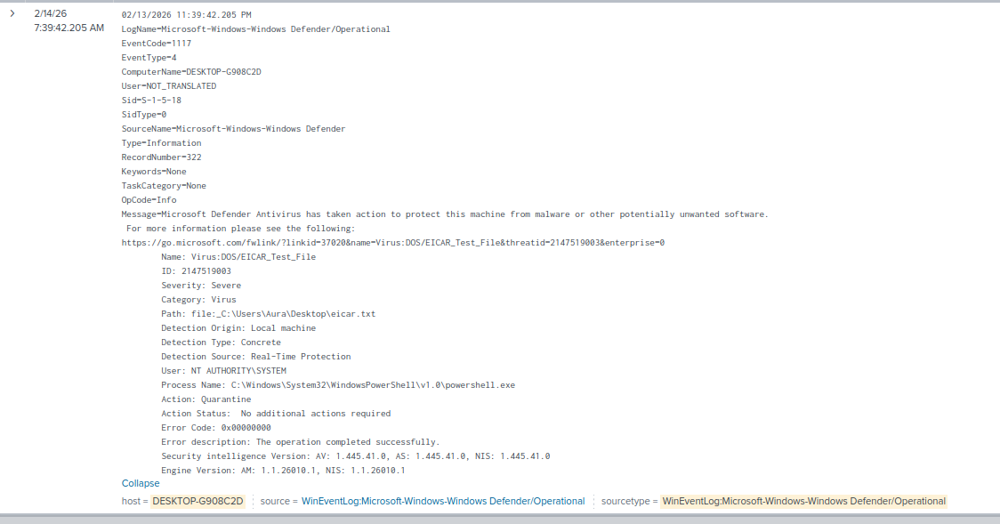
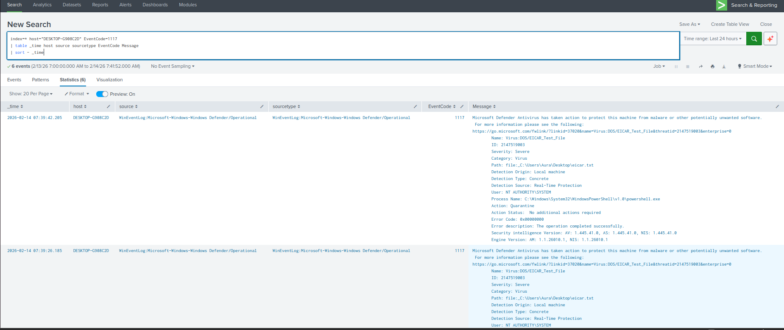

# Lab 2: Malicious PowerShell Detection

**Date:** 2026-02-12  
**Analyst:** Vishva Teja Chikoti  
**Environment:** Windows 10 VM | Sysmon | Splunk 10.2.0  
**Difficulty:** Intermediate

---

## Objective

Simulate suspicious PowerShell techniques used during post-exploitation and detect them using Sysmon Event ID 1 in Splunk. Separate directly observed telemetry from analyst assessment and avoid treating an unusual process tree as proof of process injection.

---

## NIST SP 800-61 Incident Response Phase

> **Phase 2: Detection & Analysis**  
> Suspicious PowerShell execution was detected through Sysmon process-creation telemetry. One anomalous parent-child relationship was identified and requires additional evidence before it can be classified as process injection.

## Analyst Narrative

During the investigation, PowerShell was launched repeatedly from `cmd.exe` with elevated privileges. Four suspicious techniques were observed within a 13-minute window from 05:14 to 05:27 AM.

Two additional anomalies stood out:

- PowerShell launched from `explorer.exe`
- PowerShell launched with `RuntimeBroker.exe` recorded as the parent process

### Confidence statement

**Observed:** Sysmon Event ID 1 recorded suspicious PowerShell command lines and unusual parent-child relationships.

**Assessed:** The activity is consistent with suspicious post-exploitation behavior.

**Not confirmed:** `RuntimeBroker.exe → powershell.exe` does not by itself prove process injection. It may indicate trusted-process abuse, parent PID spoofing, injected execution, or a lab artifact.

**Evidence required to confirm T1055:** Sysmon Event ID 8 (`CreateRemoteThread`), Event ID 10 (`ProcessAccess`), EDR injection telemetry, suspicious memory regions, or memory-forensics evidence.

---

## Attack Techniques Simulated

| Command | MITRE Technique | Purpose |
|---------|----------------|---------|
| IEX DownloadString | T1059.001 | Download and execute content through PowerShell |
| `-EncodedCommand` | T1027 | Obfuscate command content |
| `Get-LocalUser` | T1087.001 | Enumerate local accounts |
| `Get-Process` | T1057 | Discover running processes |

---

## Detection Query

```splunk
index=main EventCode=1 (Image="*\\powershell.exe" OR Image="*\\pwsh.exe")
| eval suspicious=case(
    match(CommandLine,"(?i)-enc(odedcommand)?"), "Encoded command",
    match(CommandLine,"(?i)downloadstring|invoke-webrequest|\biwr\b|\bcurl\b"), "Download activity",
    match(CommandLine,"(?i)executionpolicy\s+bypass"), "Execution-policy bypass",
    match(CommandLine,"(?i)windowstyle\s+hidden"), "Hidden execution",
    match(CommandLine,"(?i)get-localuser|get-process"), "Discovery command",
    true(), null()
)
| where isnotnull(suspicious)
| table _time, host, User, ParentImage, Image, CommandLine, suspicious, ProcessGuid, IntegrityLevel
| sort _time
```

### Data requirements

- Sysmon Event ID 1 enabled
- Command-line logging captured
- `Image`, `ParentImage`, `CommandLine`, `User`, and `ProcessGuid` extracted or available in raw XML

---

## Findings

**Timeline:** 05:14 AM–05:27 AM  
**User:** `DESKTOP-G908C2D\Aura`  
**Integrity Level:** High

### Primary findings

| Time | Command line | Classification | Confidence |
|------|--------------|----------------|------------|
| 05:14:05 | `IEX DownloadString http://127.0.0.1` | Suspicious download-and-execute behavior | High |
| 05:14:51 | `-EncodedCommand aQBwAGMA...` | Obfuscated PowerShell | High |
| 05:14:55 | `Get-LocalUser` | Account discovery | High |
| 05:14:59 | `Get-Process` | Process discovery | High |

### Additional anomalies

| Time | Parent-child relationship | Assessment | Confidence |
|------|---------------------------|------------|------------|
| 05:18:29 | `explorer.exe → powershell.exe` | Unusual execution path; investigate user action and command line | Medium |
| 05:19:35 | `RuntimeBroker.exe → powershell.exe` | Anomalous parent-child relationship; possible trusted-process abuse or telemetry manipulation | Medium |

The RuntimeBroker relationship is **suspicious but not confirmed process injection**.

---

## MITRE ATT&CK Mapping

| ID | Technique | Evidence status |
|----|-----------|-----------------|
| T1059.001 | PowerShell | Confirmed by PowerShell process and command line |
| T1027 | Obfuscated/Compressed Files and Information | Confirmed by `-EncodedCommand` |
| T1087.001 | Local Account Discovery | Confirmed by `Get-LocalUser` |
| T1057 | Process Discovery | Confirmed by `Get-Process` |
| T1055 | Process Injection | **Not confirmed; additional telemetry required** |

---

## Alert Rule Logic

```text
IF PowerShell contains EncodedCommand
THEN HIGH: Encoded PowerShell execution

IF PowerShell contains IEX + DownloadString
THEN HIGH: PowerShell download-and-execute behavior

IF PowerShell has an unusual parent such as RuntimeBroker.exe
THEN MEDIUM: Anomalous PowerShell parent-child relationship
AND require Event ID 8, Event ID 10, EDR, or memory evidence before labeling it process injection
```

---

## False Positives and Tuning

| Scenario | Tuning approach |
|----------|-----------------|
| Administrators running encoded scripts | Baseline approved scripts, users, hosts, and hashes |
| Software installers using PowerShell | Allowlist signed installers and known deployment paths |
| Windows-management activity | Validate parent process, signer, account, host role, and command line |
| Security tooling spawning PowerShell | Baseline approved EDR and management-agent behavior |

Avoid broad exclusions that suppress all activity from a user or parent process. Prefer narrow, evidence-based tuning.

---

## EDR Correlation — Windows Defender

**Event source:** `WinEventLog:Microsoft-Windows-Windows Defender/Operational`

| Field | Value |
|---|---|
| Event ID | 1117 — Malware Action Taken |
| Threat name | Virus:DOS/EICAR_Test_File |
| Severity | Severe |
| File path | `C:\Users\Public\test-malware.txt` |
| Process | `powershell.exe` |
| User | `NT AUTHORITY\SYSTEM` |
| Action | Quarantine |

### Splunk EDR query

```splunk
index=main source="WinEventLog:Microsoft-Windows-Windows Defender/Operational"
(EventCode=1116 OR EventCode=1117)
| table _time, host, EventCode, Message
| sort -_time
```

### Correlated assessment

| Source | Signal | Confidence |
|---|---|---|
| Sysmon Event ID 1 | Suspicious PowerShell process and command line | High |
| Process tree | Anomalous RuntimeBroker-to-PowerShell relationship | Medium |
| Defender Event ID 1117 | Test payload detected and quarantined | Confirmed |

**Analyst verdict:** Suspicious PowerShell activity is confirmed. Defender confirmed and contained the test payload. Process injection remains unconfirmed because no injection-specific telemetry was collected.

---

## Containment Decision

Defender quarantined the test payload. In a production incident, the analyst should also review related process GUIDs, network connections, Script Block Logging Event ID 4104, Event IDs 8 and 10, and activity from the same user and host before closing or escalating the case.

---

## Screenshots





---

## Key Takeaways

1. Command-line content, user context, parent process, and integrity level should be evaluated together.
2. An unusual process tree is an investigation lead, not automatic proof of injection.
3. T1055 requires injection-specific telemetry or memory evidence.
4. SIEM and endpoint-protection correlation increases confidence in the malicious-activity verdict.
5. Detection language should distinguish **observed**, **assessed**, and **confirmed** facts.
