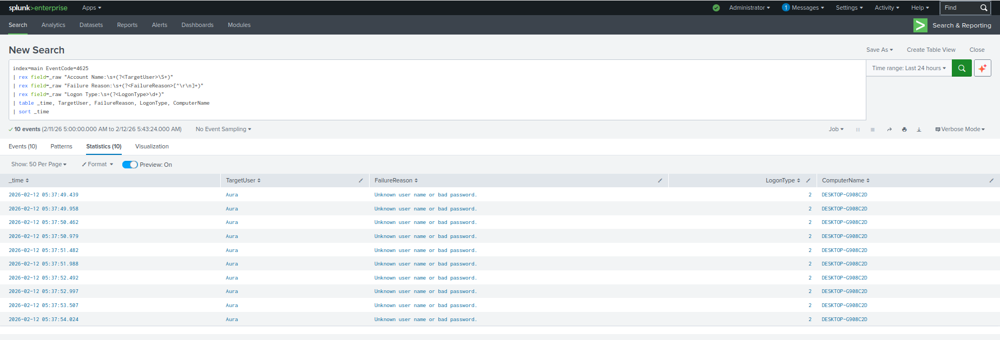
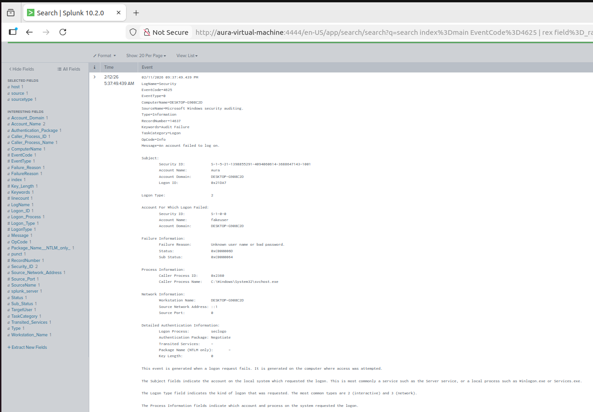

# Lab 3: Brute Force Attack Detection

**Date:** 2026-02-12
**Analyst:** Vishva Teja Chikoti
**Environment:** Windows 10 VM | Sysmon | Splunk 10.2.0
**Difficulty:** Intermediate

---

## Objective
Simulate a brute force login attack against a Windows account.
Detect using Windows Security EventCode=4625 (Failed Logon) in Splunk.

---

## NIST SP 800-61 Incident Response Phase
> **Phase 2: Detection & Analysis**
> Alert triaged, IOCs extracted, severity assessed, escalated to L2-IR.

---

## Analyst Narrative

While monitoring the security event logs, I noticed 10 failed
login attempts against user "Aura" within a 5-second window
(05:37:49 - 05:37:54 AM). The automated speed (500ms between
attempts) immediately ruled out a human typing passwords manually.

Key indicators that confirmed brute force over user error:
- 10 attempts in 5 seconds = scripted/automated
- Logon Type 2 = interactive login (attacker at console or RDP)
- Consistent failure reason = password spraying pattern
- Single target account = targeted brute force vs spray

This pattern matches T1110.001 (Password Guessing) in MITRE ATT&CK.

---

## Attack Simulation
```powershell
$username = "fakeuser"
$passwords = @("pass1","pass2","pass3","pass4","pass5",
               "pass6","pass7","pass8","pass9","pass10")
foreach ($pass in $passwords) {
    $secpass = ConvertTo-SecureString $pass -AsPlainText -Force
    $cred = New-Object System.Management.Automation.PSCredential($username, $secpass)
    try { Start-Process cmd -Credential $cred -ErrorAction Stop }
    catch {}
    Start-Sleep -Milliseconds 500
}
```

---

## Detection Queries

### Query 1: Raw Failed Logins
```splunk
index=main EventCode=4625
| rex field=_raw "Account Name:\s+(?<TargetUser>\S+)"
| rex field=_raw "Failure Reason:\s+(?<FailureReason>[^\r\n]+)"
| rex field=_raw "Logon Type:\s+(?<LogonType>\d+)"
| table _time, TargetUser, FailureReason, LogonType, ComputerName
| sort _time
```

### Query 2: Brute Force Alert Logic
```splunk
index=main EventCode=4625
| rex field=_raw "Account Name:\s+(?<TargetUser>\S+)"
| bucket _time span=1m
| stats count by _time, TargetUser
| where count > 5
| sort -count
```

---

## Findings

**Attack Window:** 05:37:49 - 05:37:54 AM (5 seconds)
**Total Attempts:** 10 failed logins
**Speed:** 1 attempt per 500ms (automated)
**Target:** DESKTOP-G908C2D\Aura
**Logon Type:** 2 (Interactive)
**Failure Reason:** Unknown user name or bad password

### Attack Classification:
| Indicator | Value | Conclusion |
|-----------|-------|------------|
| Speed | 500ms/attempt | Automated script |
| Logon Type | 2 | Direct/RDP access attempt |
| Target | Single account | Targeted attack |
| Pattern | Same error x10 | Password guessing |

---

## MITRE ATT&CK Mapping

| ID | Technique | Evidence |
|----|-----------|---------|
| T1110.001 | Password Guessing | 10 failed logins, single account |
| T1110.003 | Password Spraying | Sequential password attempts |
| T1078 | Valid Accounts | Targeting existing account "Aura" |

---

## Alert Rule Logic
```
IF EventCode=4625
AND same TargetUser
AND count > 5
WITHIN 1 minute window
THEN → HIGH alert: Brute Force Attack Detected

IF EventCode=4625 followed by EventCode=4624
(failed logins then SUCCESS)
THEN → CRITICAL alert: Brute Force SUCCEEDED
```

---

## Response Playbook

**Immediate Actions:**
1. Identify source IP of attempts
2. Check if any attempt succeeded (EventCode=4624)
3. Lock targeted account temporarily
4. Block source IP at firewall
5. Alert account owner

**Escalate if:**
- Any 4625 followed by 4624 (success after failures)
- Admin account targeted
- Multiple accounts targeted simultaneously

---

## Critical Detail: Internal Attack Indicator

Full event analysis revealed:
- Caller Process: svchost.exe (attacker hiding in legit process)
- Source Network Address: ::1 (localhost = internal origin)

This is NOT an external brute force attack.
Attacker already has access to the machine and is attempting
to compromise additional accounts from inside.

Attack chain so far:
1. Lab 1: Attacker runs recon (whoami, ipconfig, systeminfo)
2. Lab 2: Attacker runs malicious PowerShell (download, encode, harvest)
3. Lab 3: Attacker brute forces local accounts from inside machine

This is a complete post-exploitation sequence.

---

## False Positives

| Scenario | Mitigation |
|----------|------------|
| User forgot password | Usually <5 attempts, manual speed |
| Automated service misconfigured | Check source = service account |
| Password manager retry | Single burst then stops |

---

## 🎫 Ticketing & Case Management

| Field | Value |
|---|---|
| **Ticket ID** | SOC-001 |
| **Platform** | Jira Software (KAN Board) |
| **Issue Type** | Security Incident |
| **Priority** | High |
| **Assigned To** | Vishva Teja Chikoti |
| **Status** | Escalated to L2-IR |

---

### Incident Ticket — SOC-001

**Summary:** Brute Force Login Attempt Detected — DESKTOP-G908C2D

**Alert Source:** Splunk — Custom Brute Force Detection Rule
**Endpoint:** DESKTOP-G908C2D
**Detection Time:** 2026-02-12 03:45:22 UTC

---

### Timeline

| Time (UTC) | Event |
|---|---|
| 03:45:22 | 10 failed logins in 5 seconds — EventID 4625 |
| 03:45:22 | Source process: svchost.exe (localhost — internal) |
| 03:45:28 | No successful login confirmed — EventID 4624 absent |
| 03:45:30 | Alert triaged — Escalated to L2-IR |

---

### IOCs

| Indicator | Value |
|---|---|
| Source IP | 127.0.0.1 (localhost) |
| Source Process | svchost.exe |
| Target Account | Aura / Administrator |
| Failed Logins | 10 in 5 seconds |
| Successful Login | None |

---

### Severity Assessment

**Rating: HIGH**
Attack originated from localhost via svchost.exe — indicates
attacker already has internal foothold. Lateral movement risk elevated.

---

### Containment Actions

- [x] Confirmed no successful authentication (4624 absent)
- [x] svchost.exe flagged for behavioral analysis
- [x] Alert documented and escalated to L2-IR with full handoff

---

### L2 Escalation Handoff Package

| Field | Detail |
|---|---|
| **Scope** | Single endpoint — DESKTOP-G908C2D |
| **IOCs** | 127.0.0.1, svchost.exe, Aura account |
| **Timeline** | 03:45:22 — 03:45:30 UTC |
| **Actions Taken** | Triage complete, no successful auth confirmed |
| **Recommended Next** | Investigate svchost.exe parent process, check prior compromise |

---

## Screenshots





---

## Key Takeaway
Speed kills detection logic. 10 attempts in 5 seconds =
impossible for human. Always check:
1. How many attempts?
2. How fast?
3. Did any succeed? (4624 after 4625 = game over)
