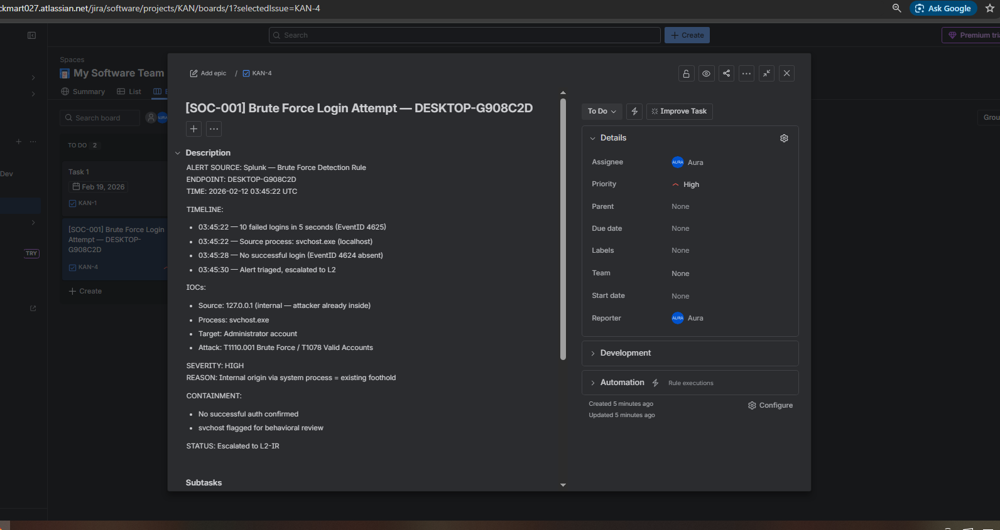
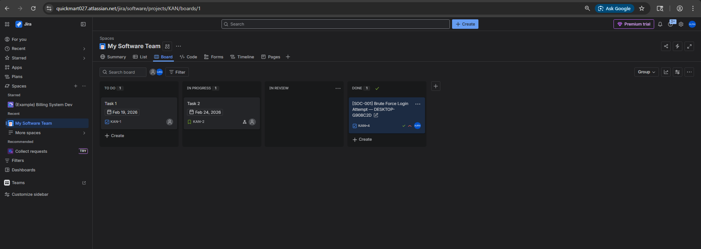
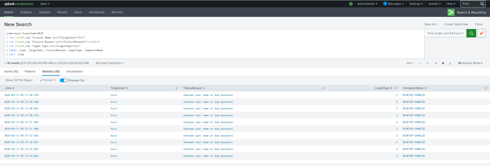
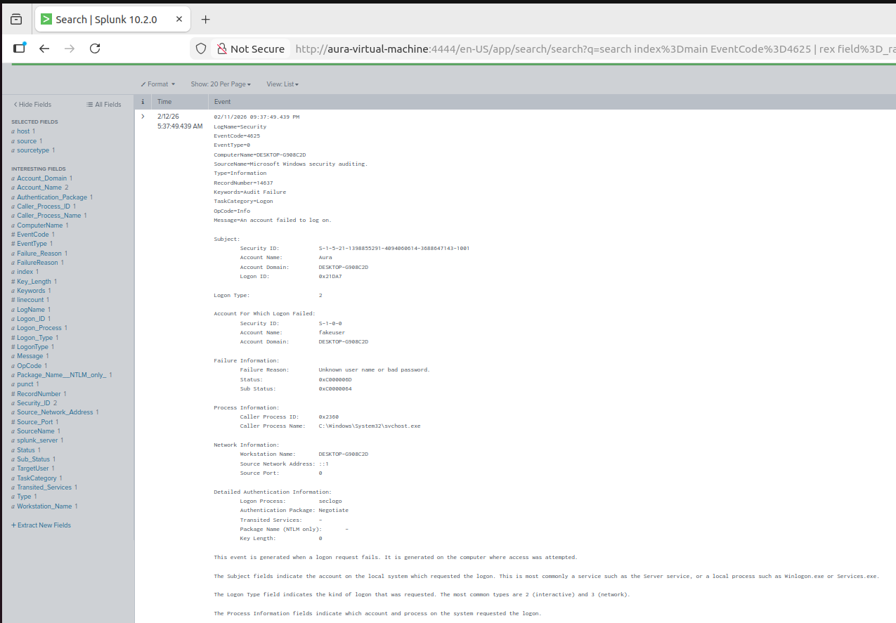

# Lab 3: Windows Password Guessing Detection

**Date:** 2026-02-12  
**Analyst:** Vishva Teja Chikoti  
**Environment:** Windows 10 VM | Windows Security Logs | Sysmon | Splunk 10.2.0  
**Difficulty:** Intermediate  
**Alert Priority:** HIGH

---

## Objective

Simulate repeated password guesses against a single Windows account and detect the resulting Event ID 4625 failed-logon events in Splunk.

The investigation focuses on:

* Detecting a rapid burst of failed authentications
* Identifying the correct target account
* Reviewing logon type and failure status
* Determining whether any attempt succeeded
* Investigating the local process responsible for the attempts
* Distinguishing password guessing from password spraying

---

## Data Source and Splunk Indexes

| Data Source | Splunk Index | Purpose |
|-------------|-------------|---------|
| Windows Security Log | `wineventlog` | Event IDs 4624, 4625, and 4740 |
| Sysmon Operational Log | `endpoint` | Process creation and process-tree investigation |
| Windows Defender Operational Log | `wineventlog` | Defender detections when relevant |

This lab primarily uses:

```spl
index=wineventlog
```

Sysmon in `index=endpoint` is used only as a secondary pivot when investigating the caller process.

---

## NIST SP 800-61 Alignment

**Observed:** Ten Event ID 4625 failed-logon events occurred within approximately five seconds.

**Assessed:** The speed and repeated attempts against one account are consistent with automated password guessing.

**Not confirmed:** The available events do not independently prove an existing attacker foothold, process injection, lateral movement, or successful account compromise.

---

## Analyst Narrative

While reviewing Windows Security events in Splunk, I identified ten failed logon attempts against the account `fakeuser` within approximately five seconds.

The attempts occurred roughly 500 milliseconds apart. This rate is highly unlikely to represent normal manual password entry and is consistent with the controlled PowerShell automation used in the lab.

The events recorded:

* Event ID 4625
* Logon Type 2
* Loopback source address `::1`
* A local caller process associated with the authentication workflow
* No confirmed successful Event ID 4624 for the same target account

### Analyst Assessment

**Observed:**

* Ten failed authentication attempts occurred
* The attempts targeted one account
* The attempts occurred within approximately five seconds
* The source address was loopback (`::1`)
* The events used Logon Type 2
* No matching successful logon was identified
* The event recorded a caller process associated with the authentication attempt

**Assessed:**

* The timing is consistent with automated password guessing
* The activity originated from the local endpoint rather than a remote network source
* The local process and its parent process require investigation

**Not confirmed:**

* Loopback activity does not prove that an attacker already controlled the machine
* A legitimate Windows process name does not prove process injection or attacker concealment
* Logon Type 2 does not represent an RDP logon
* Failed attempts do not demonstrate use of a valid account
* No successful account compromise was confirmed
* No lateral movement occurred in this simulation

---

## Attack Simulation

```powershell
$username = "fakeuser"

$passwords = @(
    "pass1","pass2","pass3","pass4","pass5",
    "pass6","pass7","pass8","pass9","pass10"
)

foreach ($pass in $passwords) {
    $securePassword = ConvertTo-SecureString $pass -AsPlainText -Force
    $credential = New-Object System.Management.Automation.PSCredential($username, $securePassword)
    try {
        Start-Process cmd.exe -Credential $credential -ErrorAction Stop
    } catch {
        # Authentication failure is expected during this simulation.
    }
    Start-Sleep -Milliseconds 500
}
```

### Simulation Classification

```
One username + multiple passwords = T1110.001 Password Guessing
```

This does not demonstrate password spraying, which requires one or a small number of passwords tested against multiple accounts.

---

## Detection Requirements

* Windows Audit Logon policy enabled
* Event ID 4625 ingested into Splunk
* Windows Security events stored in `index=wineventlog`
* Fields extracted: target account, logon type, failure reason, status, SubStatus, caller process ID, caller process name, source network address

---

## Detection Queries

### Query 1 — Raw Failed Authentication Events

```spl
index=wineventlog EventCode=4625
| rex field=_raw "(?s)Account For Which Logon Failed:.*?Account Name:\s+(?<TargetUser>[^\r\n]+)"
| rex field=_raw "(?m)^\s*Failure Reason:\s+(?<FailureReason>[^\r\n]+)"
| rex field=_raw "(?m)^\s*Status:\s+(?<Status>0x[0-9A-Fa-f]+)"
| rex field=_raw "(?m)^\s*Sub Status:\s+(?<SubStatus>0x[0-9A-Fa-f]+)"
| rex field=_raw "(?m)^\s*Logon Type:\s+(?<LogonType>\d+)"
| rex field=_raw "(?m)^\s*Caller Process Name:\s+(?<CallerProcessName>[^\r\n]+)"
| rex field=_raw "(?m)^\s*Source Network Address:\s+(?<SourceIP>[^\r\n]+)"
| table _time host TargetUser FailureReason Status SubStatus LogonType SourceIP CallerProcessName
| sort _time
```

The extraction is anchored to the **Account For Which Logon Failed** section to avoid capturing the subject account that reported the event.

---

### Query 2 — Password Guessing Alert

```spl
index=wineventlog EventCode=4625
| rex field=_raw "(?s)Account For Which Logon Failed:.*?Account Name:\s+(?<TargetUser>[^\r\n]+)"
| rex field=_raw "(?m)^\s*Logon Type:\s+(?<LogonType>\d+)"
| rex field=_raw "(?m)^\s*Caller Process Name:\s+(?<CallerProcessName>[^\r\n]+)"
| rex field=_raw "(?m)^\s*Source Network Address:\s+(?<SourceIP>[^\r\n]+)"
| eval event_time=_time
| bin _time span=1m
| stats
    count AS failures
    min(event_time) AS first_seen
    max(event_time) AS last_seen
    values(LogonType) AS logon_types
    values(CallerProcessName) AS caller_processes
    BY _time host TargetUser SourceIP
| where failures >= 6
| eval duration_seconds=last_seen-first_seen
| convert ctime(first_seen) ctime(last_seen)
| sort -failures
```

**Alert condition:** Same target account receives 6+ failed logons from the same source on the same host within one minute.

---

### Query 3 — Failure Followed by Successful Logon

```spl
index=wineventlog (EventCode=4624 OR EventCode=4625)
| rex field=_raw "(?s)Account For Which Logon Failed:.*?Account Name:\s+(?<FailedTargetUser>[^\r\n]+)"
| rex field=_raw "(?s)New Logon:.*?Account Name:\s+(?<SuccessfulTargetUser>[^\r\n]+)"
| eval TargetUser=coalesce(FailedTargetUser, SuccessfulTargetUser)
| rex field=_raw "(?m)^\s*Logon Type:\s+(?<LogonType>\d+)"
| rex field=_raw "(?m)^\s*Source Network Address:\s+(?<SourceIP>[^\r\n]+)"
| eval event_time=_time
| bin _time span=5m
| stats
    count(eval(EventCode=4625)) AS failures
    count(eval(EventCode=4624)) AS successes
    min(event_time) AS first_seen
    max(event_time) AS last_seen
    BY _time host TargetUser SourceIP
| where failures >= 5 AND successes >= 1
| convert ctime(first_seen) ctime(last_seen)
| sort -failures
```

This is a triage query — analyst must verify that failures and successes share the same account, source, destination, logon type, and time window before concluding success.

---

### Query 4 — Account Lockout Confirmation

```spl
index=wineventlog EventCode=4740
| rex field=_raw "(?m)^\s*Account Name:\s+(?<LockedAccount>[^\r\n]+)"
| rex field=_raw "(?m)^\s*Caller Computer Name:\s+(?<CallerComputer>[^\r\n]+)"
| table _time host LockedAccount CallerComputer
| sort -_time
```

---

### Query 5 — Sysmon Caller-Process Pivot

```spl
index=endpoint EventCode=1
| table _time host User ProcessId ProcessGuid Image ParentImage CommandLine IntegrityLevel
| sort _time
```

Filter by the affected host, the authentication-event time window, and the caller process ID from Event ID 4625. Do not conclude that a common process name indicates injection — review the full path, signature, command line, and parent process.

---

## Findings

**Attack Window:** 05:37:49–05:37:54 | **Duration:** ~5 seconds | **Total:** 10 failed logons  
**Target:** `fakeuser` | **Logon Type:** 2 | **Source:** `::1` | **Successful Logon:** Not observed

| Indicator | Value | Assessment |
|-----------|-------|-----------|
| Failure count | 10 | High-volume authentication failure |
| Duration | ~5 seconds | Consistent with automation |
| Target count | 1 account | Password guessing, not spraying |
| Logon Type | 2 | Interactive logon attempt |
| Source | `::1` | Activity originated from local host |
| Successful 4624 | None | Compromise not confirmed |

---

## MITRE ATT&CK Mapping

| Technique ID | Technique | Evidence | Status |
|-------------|-----------|---------|--------|
| T1110.001 | Brute Force: Password Guessing | Multiple passwords tested against one account | Confirmed |

**Excluded mappings:**
- **T1110.003 Password Spraying** — Not demonstrated. One account targeted with multiple passwords.
- **T1078 Valid Accounts** — Not demonstrated. No successful authentication confirmed.

---

## Alert Rule Logic

```
IF Event ID 4625 occurs 6+ times
against the same account from the same source within 1 minute
THEN HIGH: Possible Password Guessing

IF matching Event ID 4624 follows the failures
for the same account, source, logon type, and time window
THEN CRITICAL: Possible Successful Password Guessing

IF Event ID 4740 occurs for the target account
THEN increase confidence — evaluate business impact
```

---

## False Positives and Tuning

| Scenario | Validation |
|----------|-----------|
| User repeatedly enters wrong password | Compare timing, source, workstation, user confirmation |
| Service using expired password | Identify service account, process, recent password changes |
| Scheduled task with stale credentials | Validate task name, schedule, service account |
| Mapped drive using old credentials | Review target system, process, Credential Manager |
| Application retry loop | Identify application process and expected retry behavior |
| Security test | Validate approved system, user, time window, ticket |

Tune using narrow combinations of: account, source, destination, process, logon type, authentication package, host role, approved time window.

---

## Ticketing Reference — SOC-001

| Field | Value |
|-------|-------|
| Ticket ID | SOC-001 |
| Platform | Jira Software |
| Summary | Automated Password Guessing Detected on DESKTOP-G908C2D |
| Priority | HIGH |
| Target | `fakeuser` — 10 failures in ~5 seconds from `::1` |
| Successful logon | Not observed |
| Next step | Correlate caller PID with Sysmon — validate authorization |

---

## Screenshots






---

## Lessons Learned

1. Multiple passwords against one account is password guessing — not password spraying
2. Failed attempts do not demonstrate valid-account abuse
3. Logon Type 2 means interactive logon — RDP uses Logon Type 10
4. Loopback addresses identify local activity but do not prove an existing attacker foothold
5. A common process name does not prove process injection or attacker concealment
6. The failed target account must be extracted from the correct event section
7. Correlate failures and successes by account, source, destination, logon type, and time
8. Do not block localhost as though it were a remote attacker IP
9. Use `index=wineventlog` for Windows Security events
10. Use `index=endpoint` when pivoting into Sysmon process telemetry