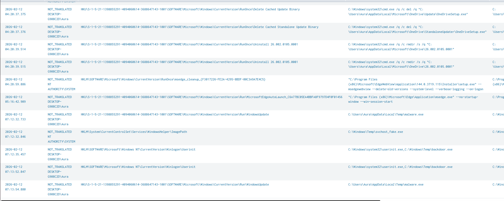

# Lab 6: Persistence Mechanism Detection

**Date:** 2026-02-12
**Analyst:** Vishva Teja Chikoti
**Severity:** CRITICAL
**Difficulty:** Advanced

---

## Objective
Simulate attacker persistence mechanisms on Windows VM.
Detect registry-based persistence using Sysmon EventCode=13
(Registry Value Set) in Splunk. Identify and classify
multiple simultaneous persistence techniques.

## NIST SP 800-61 Incident Response Phase
> **Phase 3: Containment & Eradication → Phase 4: Recovery**
> Three simultaneous persistence mechanisms identified and documented.
> Run Key + Fake Service + Winlogon hijack. Severity: CRITICAL.

---

## Lab Setup

| Component | Detail |
|-----------|--------|
| Environment | Windows 10 VM |
| Data Source | Sysmon Registry Events |
| Tools Used | Splunk 10.2.0, Sysmon 15.15, reg.exe |
| Key Event ID | Sysmon EventCode=13 (Registry Value Set) |

---

## Analyst Narrative

During threat hunting exercise, I searched for suspicious
registry modifications across common persistence locations.
What I found was not one persistence mechanism — but three
simultaneous techniques deployed at 07:12 AM, suggesting
an attacker who planted multiple backdoors to ensure
redundant access.

The most dangerous finding: Winlogon\Userinit hijack.
This fires BEFORE the desktop loads on every login —
meaning the backdoor runs with no user interaction required
and survives reboots indefinitely.

The attacker also used naming camouflage:
- "WindowsUpdate" (Run key) — looks like legitimate update
- "WindowsHelper" (Service) — sounds like a system service
- svchost_fake.exe — named after legitimate Windows process

Without hunting specifically for Temp directory paths in
registry values, these would blend into normal system activity.

---

## Attack Simulation
```cmd
# Method 1: Run Key Persistence
reg add "HKCU\Software\Microsoft\Windows\CurrentVersion\Run" /v "WindowsUpdate" /t REG_SZ /d "C:\Users\Aura\AppData\Local\Temp\malware.exe" /f

# Method 2: Fake Service
sc create "WindowsHelper" binpath= "C:\Windows\Temp\svchost_fake.exe" start= auto

# Method 3: Winlogon Hijack
reg add "HKLM\SOFTWARE\Microsoft\Windows NT\CurrentVersion\Winlogon" /v "Userinit" /t REG_SZ /d "C:\Windows\system32\userinit.exe,C:\Windows\Temp\backdoor.exe" /f
```

---

## Detection Queries

### Query 1: Registry Persistence Hunt
```splunk
index=main EventCode=13
| rex field=_raw "TargetObject:\s+(?<RegKey>[^\r\n]+)"
| rex field=_raw "Details:\s+(?<RegValue>[^\r\n]+)"
| search RegKey="*CurrentVersion\\Run*"
  OR RegKey="*Winlogon*Userinit*"
  OR RegValue="*Temp*"
  OR RegValue="*malware*"
  OR RegValue="*payload*"
  OR RegValue="*backdoor*"
| table _time, User, RegKey, RegValue, Image
| sort _time
```

### Query 2: Suspicious Service Creation
```splunk
index=main EventCode=13
| rex field=_raw "TargetObject:\s+(?<RegKey>[^\r\n]+)"
| rex field=_raw "Details:\s+(?<RegValue>[^\r\n]+)"
| search RegKey="*Services*ImagePath*"
  AND (RegValue="*Temp*" OR RegValue="*AppData*" OR RegValue="*Users*")
| table _time, User, RegKey, RegValue
| sort _time
```

### Query 3: Winlogon Hijack Detection
```splunk
index=main EventCode=13
| rex field=_raw "TargetObject:\s+(?<RegKey>[^\r\n]+)"
| rex field=_raw "Details:\s+(?<RegValue>[^\r\n]+)"
| search RegKey="*Winlogon*"
  AND RegValue="*,*"
| table _time, User, RegKey, RegValue
| sort _time
```
*Winlogon\Userinit should NEVER have a comma + second path*

---

## Findings

**Attack Window:** 07:12:32 - 07:13:54 AM (82 seconds)
**Persistence Methods Deployed:** 3 simultaneous
**Camouflage Used:** All named as legitimate Windows components

### Malicious Registry Entries Detected:

| Time | Method | Registry Key | Malicious Value |
|------|--------|-------------|-----------------|
| 07:12:32 | Run Key | HKCU\...\Run\WindowsUpdate | C:\Temp\malware.exe |
| 07:12:32 | Fake Service | Services\WindowsHelper\ImagePath | C:\Windows\Temp\svchost_fake.exe |
| 07:12:35 | Winlogon Hijack | Winlogon\Userinit | userinit.exe,backdoor.exe |
| 07:13:52 | Winlogon Hijack | Winlogon\Userinit | backdoor.exe (repeat) |
| 07:13:54 | Run Key | HKCU\...\Run\WindowsUpdate | malware.exe (repeat) |

### Persistence Method Analysis:

| Method | Trigger | Stealth Level | Danger |
|--------|---------|--------------|--------|
| Run Key (WindowsUpdate) | Every user login | Medium (named like update) | HIGH |
| Fake Service (WindowsHelper) | System startup | High (sounds legitimate) | HIGH |
| Winlogon Userinit Hijack | Every login pre-desktop | Very High (hard to notice) | CRITICAL |

---

## MITRE ATT&CK Mapping

| ID | Technique | Evidence |
|----|-----------|---------|
| T1547.001 | Registry Run Keys | HKCU\...\Run\WindowsUpdate |
| T1543.003 | Windows Service | WindowsHelper fake service |
| T1547.004 | Winlogon Helper DLL | Userinit hijack |
| T1036.005 | Match Legitimate Name | svchost_fake.exe naming |
| T1112 | Modify Registry | All reg add commands |

---

## Alert Rule Logic
```
IF EventCode=13
AND RegKey contains "CurrentVersion\Run"
AND RegValue contains "\Temp\" OR "\AppData\"
THEN → HIGH: Suspicious Run Key Persistence

IF EventCode=13
AND RegKey contains "Winlogon\Userinit"
AND RegValue contains ","
THEN → CRITICAL: Winlogon Hijack Detected

IF EventCode=13
AND RegKey contains "Services" AND "ImagePath"
AND RegValue contains "\Temp\" OR "\Users\"
THEN → HIGH: Suspicious Service Binary Path
```

---

## Risk Rating

**CRITICAL**

| Factor | Assessment |
|--------|-----------|
| 3 simultaneous persistence methods | CRITICAL |
| Winlogon hijack (pre-login execution) | CRITICAL |
| Naming camouflage (WindowsUpdate, svchost) | HIGH |
| Survives reboots | CRITICAL |
| Redundant backdoors | HIGH |

---

## Containment Actions
```
1. Remove malicious Run keys immediately
   reg delete "HKCU\Software\Microsoft\Windows\CurrentVersion\Run" /v "WindowsUpdate" /f

2. Restore Winlogon Userinit to clean state
   reg add "HKLM\SOFTWARE\Microsoft\Windows NT\CurrentVersion\Winlogon" /v "Userinit" /t REG_SZ /d "C:\Windows\system32\userinit.exe," /f

3. Stop and delete fake service
   sc stop WindowsHelper
   sc delete WindowsHelper

4. Delete malicious binaries
   del C:\Users\Aura\AppData\Local\Temp\malware.exe
   del C:\Windows\Temp\svchost_fake.exe
   del C:\Windows\Temp\backdoor.exe

5. Scan for additional persistence (scheduled tasks, startup folder)
6. Isolate system pending full forensic investigation
7. Escalate to L2 — assume full compromise
```

---

## False Positives

| Scenario | Mitigation |
|----------|------------|
| Legitimate software in Run keys | Check vendor signature, known path |
| System services update ImagePath | Verify against known-good baseline |
| Software installer modifying Userinit | Should never add comma + second path |

---

## Screenshots


---

## Lessons Learned
1. Winlogon\Userinit with comma = always malicious
2. Run key named "WindowsUpdate" ≠ Windows Update
3. Service binary in \Temp\ = never legitimate
4. 3 persistence methods = professional attacker
5. Hunt by path patterns (Temp, AppData) not just key names
6. Redundant persistence = attacker expects detection of one
```

