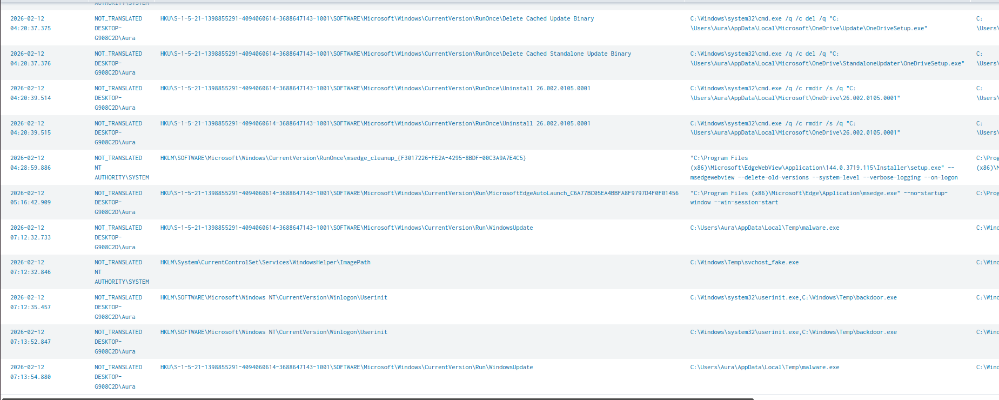

# Lab 6: Windows Persistence Mechanism Detection

**Date:** 2026-02-12
**Analyst:** Vishva Teja Chikoti
**Environment:** Windows 10 VM | Sysmon | Windows Security Logs | Splunk 10.2.0
**Difficulty:** Advanced
**Alert Priority:** CRITICAL

---

## Objective

Simulate and detect three Windows persistence mechanisms in an isolated lab:

1. Registry Run Key persistence
2. Windows service persistence
3. Winlogon `Userinit` modification

The investigation focuses on:

* Detecting suspicious registry value changes
* Identifying newly installed services
* Validating executable paths
* Distinguishing normal registry configuration from malicious modification
* Correlating registry, service, process, and file telemetry
* Preserving evidence before remediation

---

## NIST SP 800-61 Alignment

This lab demonstrates incident detection, evidence analysis, scope assessment, containment planning, eradication, and recovery validation.

**Observed:** Three persistence-related configuration changes were created during the controlled simulation.

**Assessed:** The Run key, service configuration, and Winlogon modification would provide repeated execution if the referenced binaries existed and were executable.

**Not confirmed:** Registry configuration alone does not prove that every referenced payload executed successfully, survived a reboot, or belonged to a real attacker.

---

## Lab Setup

| Component              | Detail                                          |
| ---------------------- | ----------------------------------------------- |
| Environment            | Windows 10 VM                                   |
| Registry telemetry     | Sysmon Event IDs 12, 13, and 14                 |
| Process telemetry      | Sysmon Event ID 1                               |
| File telemetry         | Sysmon Event ID 11                              |
| Service telemetry      | Windows Security Event ID 4697 when enabled     |
| Tools                  | Splunk 10.2.0, Sysmon 15.x, `reg.exe`, `sc.exe` |
| Sysmon index           | `endpoint`                                      |
| Windows Security index | `wineventlog`                                   |

Use the exact Sysmon version installed in the final report rather than assuming a version number.

---

## Analyst Narrative

During a controlled persistence simulation, three Windows autostart mechanisms were configured within approximately 82 seconds:

* A per-user Run key named `WindowsUpdate`
* An automatically starting service named `WindowsHelper`
* A modified Winlogon `Userinit` value containing an additional executable

The configured executable paths pointed to user-writable or temporary directories:

* `C:\Users\Aura\AppData\Local\Temp\malware.exe`
* `C:\Windows\Temp\svchost_fake.exe`
* `C:\Windows\Temp\backdoor.exe`

These paths and names increase suspicion, but the investigation must still validate:

* Whether the files existed
* Their hashes and signatures
* Which process created the registry values
* Whether the service was installed successfully
* Whether the payloads executed
* Whether the changes were part of authorized testing or software installation

### Confidence Statement

**Observed:**

* A Run key value was created.
* A Windows service was configured.
* The Winlogon `Userinit` value was modified.
* The values referenced executables in temporary or user-writable paths.
* The changes occurred in a short time window during the simulation.

**Assessed:**

* Each configuration is capable of supporting repeated execution.
* The combined sequence represents multiple persistence mechanisms.
* The names appear intended to resemble legitimate Windows components.
* The Winlogon modification represents the highest-risk configuration change.

**Not confirmed:**

* The files executed successfully.
* The service started successfully.
* The changes survived a reboot.
* The activity represented a real external attacker.
* Multiple persistence methods prove a sophisticated or professional threat actor.
* Every executable in a temporary directory is malicious.

---

## Attack Simulation

Run only inside an isolated lab.

```cmd
REM Method 1: Registry Run Key persistence
reg add "HKCU\Software\Microsoft\Windows\CurrentVersion\Run" ^
 /v "WindowsUpdate" ^
 /t REG_SZ ^
 /d "C:\Users\Aura\AppData\Local\Temp\malware.exe" ^
 /f

REM Method 2: Windows service persistence
sc.exe create "WindowsHelper" ^
 binPath= "C:\Windows\Temp\svchost_fake.exe" ^
 start= auto

REM Method 3: Winlogon Userinit modification
reg add "HKLM\SOFTWARE\Microsoft\Windows NT\CurrentVersion\Winlogon" ^
 /v "Userinit" ^
 /t REG_SZ ^
 /d "C:\Windows\System32\userinit.exe,C:\Windows\Temp\backdoor.exe" ^
 /f
```

### Important Lab Note

The normal `Userinit` configuration commonly contains:

```text
C:\Windows\System32\userinit.exe,
```

The trailing comma alone is not sufficient evidence of malicious activity.

The suspicious condition is an additional nonempty executable or command after the expected `userinit.exe,` entry.

---

## Data Requirements

### Sysmon

* Event ID 1 — Process creation
* Event ID 11 — File creation
* Event ID 12 — Registry object creation or deletion
* Event ID 13 — Registry value set
* Event ID 14 — Registry key or value rename

### Windows Security

* Event ID 4697 — New service installed, when the required audit policy is enabled

### Required Fields

* `TargetObject`
* `Details`
* `Image`
* `User`
* `ProcessId`
* `ProcessGuid`
* `CommandLine`
* `Hashes`
* `ServiceName`
* `ServiceFileName`
* `ServiceStartType`
* `host`

---

## Detection Queries

### Query 1 — Suspicious Run Key Modification

```spl
index=endpoint
sourcetype="XmlWinEventLog:Microsoft-Windows-Sysmon/Operational"
EventCode=13
| eval registry_path=lower(TargetObject)
| eval registry_value=lower(Details)
| where match(
    registry_path,
    "(?i)\\software\\microsoft\\windows\\currentversion\\run(once)?\\"
)
| eval suspicious_path=if(
    match(
        registry_value,
        "(?i)\\users\\[^\\]+\\appdata\\|\\temp\\|\\downloads\\|\\public\\"
    ),
    1,
    0
)
| table _time host User Image ProcessId ProcessGuid TargetObject Details suspicious_path
| sort -_time
```

### Interpretation

A Run key is not automatically malicious.

Increase confidence when:

* The value points to a user-writable directory
* The binary is unsigned or newly created
* The name impersonates an operating-system component
* The modifying process is unusual
* The change occurs without an approved installation
* The value is followed by execution at user logon

---

### Query 2 — Winlogon Userinit Modification

```spl
index=endpoint
sourcetype="XmlWinEventLog:Microsoft-Windows-Sysmon/Operational"
EventCode=13
| eval registry_path=lower(TargetObject)
| eval registry_value=lower(Details)
| where match(
    registry_path,
    "(?i)\\microsoft\\windows nt\\currentversion\\winlogon\\userinit$"
)
| eval normalized_value=replace(registry_value, "\"", "")
| where match(
    normalized_value,
    "(?i)userinit\.exe,\s*[^,\s].*"
)
| table _time host User Image ProcessId ProcessGuid TargetObject Details
| sort -_time
```

This query looks for nonempty content after `userinit.exe,`.

It does not alert merely because the value ends with the expected trailing comma.

---

### Query 3 — Broader Winlogon Persistence Hunt

```spl
index=endpoint
sourcetype="XmlWinEventLog:Microsoft-Windows-Sysmon/Operational"
EventCode=13
| eval registry_path=lower(TargetObject)
| where match(
    registry_path,
    "(?i)\\microsoft\\windows nt\\currentversion\\winlogon\\(userinit|shell|notify)"
)
| table _time host User Image ProcessId ProcessGuid TargetObject Details
| sort -_time
```

Review modifications to:

* `Userinit`
* `Shell`
* `Notify`

Compare each value against a known-good baseline.

---

### Query 4 — Service Registry Modification

```spl
index=endpoint
sourcetype="XmlWinEventLog:Microsoft-Windows-Sysmon/Operational"
EventCode=13
| eval registry_path=lower(TargetObject)
| eval registry_value=lower(Details)
| where match(
    registry_path,
    "(?i)\\system\\currentcontrolset\\services\\[^\\]+\\imagepath$"
)
| eval suspicious_path=if(
    match(
        registry_value,
        "(?i)\\temp\\|\\users\\|\\appdata\\|\\downloads\\|\\public\\"
    ),
    1,
    0
)
| table _time host User Image ProcessId ProcessGuid TargetObject Details suspicious_path
| sort -_time
```

A service path in a temporary or user-writable location is a high-risk anomaly, not automatic proof of malware.

Validate:

* File existence
* Signature
* Hash
* Service name
* Service account
* Start type
* Installation source
* Change ticket

---

### Query 5 — New Service Installation

```spl
index=wineventlog
source="WinEventLog:Security"
EventCode=4697
| rex field=_raw "(?m)^\s*Service Name:\s+(?<ServiceName>[^\r\n]+)"
| rex field=_raw "(?m)^\s*Service File Name:\s+(?<ServiceFileName>[^\r\n]+)"
| rex field=_raw "(?m)^\s*Service Type:\s+(?<ServiceType>[^\r\n]+)"
| rex field=_raw "(?m)^\s*Service Start Type:\s+(?<ServiceStartType>[^\r\n]+)"
| rex field=_raw "(?m)^\s*Service Account:\s+(?<ServiceAccount>[^\r\n]+)"
| eval service_path_lower=lower(ServiceFileName)
| eval suspicious_path=if(
    match(
        service_path_lower,
        "(?i)\\temp\\|\\users\\|\\appdata\\|\\downloads\\|\\public\\"
    ),
    1,
    0
)
| table _time host ServiceName ServiceFileName ServiceType ServiceStartType ServiceAccount suspicious_path
| sort -_time
```

---

### Query 6 — Persistence Process Correlation

```spl
index=endpoint
sourcetype="XmlWinEventLog:Microsoft-Windows-Sysmon/Operational"
EventCode=1
(
    Image="*\\reg.exe"
    OR Image="*\\sc.exe"
    OR CommandLine="*CurrentVersion\\Run*"
    OR CommandLine="*CurrentVersion\\Winlogon*"
    OR CommandLine="*WindowsHelper*"
)
| table _time host User Image ParentImage CommandLine ProcessId ProcessGuid ParentProcessId ParentProcessGuid IntegrityLevel Hashes
| sort -_time
```

This establishes which process and user performed the persistence configuration.

---

### Query 7 — Referenced File Creation

```spl
index=endpoint
sourcetype="XmlWinEventLog:Microsoft-Windows-Sysmon/Operational"
EventCode=11
(
    TargetFilename="*\\AppData\\Local\\Temp\\malware.exe"
    OR TargetFilename="*\\Windows\\Temp\\svchost_fake.exe"
    OR TargetFilename="*\\Windows\\Temp\\backdoor.exe"
)
| table _time host User Image ProcessId ProcessGuid TargetFilename
| sort -_time
```

Registry evidence should be correlated with file creation and process execution whenever possible.

---

## Findings

**Simulation window:** 07:12:32–07:13:54 AM
**Duration:** Approximately 82 seconds
**Persistence configurations created:** Three

### Observed Configuration Changes

| Time     | Mechanism       | Configuration                       | Referenced Value                               |
| -------- | --------------- | ----------------------------------- | ---------------------------------------------- |
| 07:12:32 | Run key         | `HKCU\...\Run\WindowsUpdate`        | `C:\Users\Aura\AppData\Local\Temp\malware.exe` |
| 07:12:32 | Windows service | `WindowsHelper` service `ImagePath` | `C:\Windows\Temp\svchost_fake.exe`             |
| 07:12:35 | Winlogon        | `Winlogon\Userinit`                 | `userinit.exe,C:\Windows\Temp\backdoor.exe`    |
| 07:13:52 | Winlogon        | Repeated `Userinit` modification    | Validate exact value from raw telemetry        |
| 07:13:54 | Run key         | Repeated Run-key modification       | Validate exact path from raw telemetry         |

### Evidence Consistency Note

The simulation command uses:

```text
C:\Users\Aura\AppData\Local\Temp\malware.exe
```

Use this same path in the findings table unless the actual Sysmon evidence shows a different path.

Do not alternate between this value and `C:\Temp\malware.exe` without evidence.

---

## Persistence Assessment

| Mechanism                        | Expected Trigger                        | Assessment                                                            | Confidence    |
| -------------------------------- | --------------------------------------- | --------------------------------------------------------------------- | ------------- |
| Run key                          | User logon                              | Capable of launching the configured executable                        | High          |
| Automatic service                | System startup or service start         | Capable of repeated execution, potentially under a privileged account | High          |
| Winlogon `Userinit` modification | Interactive user logon                  | Additional executable may run during logon                            | High          |
| Successful payload execution     | Requires process evidence               | Not established by registry events alone                              | Not confirmed |
| Reboot persistence validation    | Requires reboot and follow-up telemetry | Not demonstrated unless separately tested                             | Not confirmed |

---

## MITRE ATT&CK Mapping

| Technique ID | Technique                                                             | Evidence                                                               | Status               |
| ------------ | --------------------------------------------------------------------- | ---------------------------------------------------------------------- | -------------------- |
| T1547.001    | Boot or Logon Autostart Execution: Registry Run Keys / Startup Folder | Run key created under the current user                                 | Confirmed simulation |
| T1543.003    | Create or Modify System Process: Windows Service                      | `WindowsHelper` service configured                                     | Confirmed simulation |
| T1547.004    | Boot or Logon Autostart Execution: Winlogon Helper DLL                | `Userinit` value modified                                              | Confirmed simulation |
| T1036.005    | Masquerading: Match Legitimate Resource Name or Location              | Names such as `WindowsUpdate`, `WindowsHelper`, and `svchost_fake.exe` | Assessed             |
| T1112        | Modify Registry                                                       | Run key, service registry values, and Winlogon value modified          | Confirmed            |

### Mapping Limitation

The word “fake” in `svchost_fake.exe` makes the lab artifact obviously suspicious and is less realistic than a true legitimate-name match.

For a stronger simulation, use a benign test executable with a controlled name and clearly document that it is a lab artifact.

---

## Alert Logic

```text
IF a Run or RunOnce value is created
AND the executable path is user-writable or unusual
THEN HIGH: Suspicious Run-Key Persistence

IF Winlogon\Userinit contains a nonempty executable
after the expected userinit.exe, entry
THEN CRITICAL: Suspicious Winlogon Userinit Modification

IF a new service is installed
AND its executable is in a temporary or user-writable directory
THEN HIGH: Suspicious Windows Service

IF multiple persistence mechanisms are configured
by the same user or process in a short window
THEN increase confidence and incident priority

DO NOT classify a value as malicious
based solely on a comma, name, or directory
```

---

## Risk Assessment

### Severity: CRITICAL in the Controlled Simulation

| Factor                                          | Assessment    |
| ----------------------------------------------- | ------------- |
| Multiple persistence configurations             | Critical      |
| Winlogon authentication-path modification       | Critical      |
| Automatic service configuration                 | High          |
| Executables in temporary or user-writable paths | High          |
| Misleading operating-system-style names         | High          |
| Successful payload execution                    | Not confirmed |
| Reboot persistence validation                   | Not confirmed |
| External attacker attribution                   | Not confirmed |

### Production Severity Guidance

A production alert should be rated CRITICAL when:

* The changes are unauthorized
* Referenced binaries exist and are untrusted
* Execution is confirmed
* A privileged service account is involved
* The endpoint is critical
* Multiple persistence techniques are present
* The activity correlates with compromise evidence

---

## Containment and Evidence Preservation

Do not immediately delete the registry values and binaries before preserving evidence.

### Phase 1 — Preserve Evidence

1. Isolate the endpoint when malicious activity is supported.
2. Record the exact registry paths and values.
3. Export affected registry keys.
4. Record service configuration.
5. Calculate file hashes.
6. Collect file metadata and digital signatures.
7. Preserve Sysmon, Security, and System logs.
8. Record process trees and process GUIDs.
9. Capture volatile evidence when required.
10. Document timestamps and analyst actions.

### Evidence Collection Commands

```powershell
reg export `
  "HKCU\Software\Microsoft\Windows\CurrentVersion\Run" `
  ".\RunKey-Evidence.reg" `
  /y

reg export `
  "HKLM\SOFTWARE\Microsoft\Windows NT\CurrentVersion\Winlogon" `
  ".\Winlogon-Evidence.reg" `
  /y

sc.exe qc WindowsHelper

Get-FileHash `
  "C:\Users\Aura\AppData\Local\Temp\malware.exe" `
  -Algorithm SHA256

Get-FileHash `
  "C:\Windows\Temp\svchost_fake.exe" `
  -Algorithm SHA256

Get-FileHash `
  "C:\Windows\Temp\backdoor.exe" `
  -Algorithm SHA256
```

---

### Phase 2 — Eradicate Validated Lab Artifacts

After evidence collection:

```cmd
REM Remove the Run key value
reg delete "HKCU\Software\Microsoft\Windows\CurrentVersion\Run" ^
 /v "WindowsUpdate" ^
 /f

REM Restore the known-good Userinit value
reg add "HKLM\SOFTWARE\Microsoft\Windows NT\CurrentVersion\Winlogon" ^
 /v "Userinit" ^
 /t REG_SZ ^
 /d "C:\Windows\System32\userinit.exe," ^
 /f

REM Stop and delete the test service
sc.exe stop WindowsHelper
sc.exe delete WindowsHelper
```

Delete files only after hashes and required forensic evidence have been collected.

```cmd
del "C:\Users\Aura\AppData\Local\Temp\malware.exe"
del "C:\Windows\Temp\svchost_fake.exe"
del "C:\Windows\Temp\backdoor.exe"
```

---

### Phase 3 — Recovery Validation

1. Confirm the Run key value is absent.
2. Confirm the `Userinit` value matches the approved baseline.
3. Confirm the service no longer exists.
4. Confirm the test files are removed.
5. Reboot the isolated lab system.
6. Validate that none of the test payloads execute after reboot or logon.
7. Search for additional persistence:

   * Scheduled tasks
   * Startup folders
   * WMI subscriptions
   * Services
   * Winlogon values
   * AppInit DLLs
   * Logon scripts
8. Monitor the endpoint for recurrence.
9. Document recovery evidence.

---

## False Positives and Tuning

| Scenario                                  | Validation                                                               |
| ----------------------------------------- | ------------------------------------------------------------------------ |
| Legitimate application creating a Run key | Validate signer, vendor, installation source, path, and change ticket    |
| Software installation creating a service  | Confirm approved installer, service path, account, and deployment record |
| Administrative repair of Winlogon values  | Compare against the approved baseline and ticket                         |
| Security product installing a service     | Validate signer, product ownership, and management server                |
| Application executing from AppData        | Review signature, hash, reputation, user context, and expected behavior  |
| Installer staging content in Temp         | Correlate with installer process, signature, and installation timeline   |

Avoid broad exclusions based only on:

* Administrator account
* Service name
* `Temp` or `AppData`
* Microsoft-like naming
* A single known path

Tune using combinations of:

* Full path
* Hash
* Digital signature
* Parent process
* Installer identity
* User
* Host role
* Service account
* Change window
* Approved software inventory

---

## Screenshots



---

## Lessons Learned

1. A trailing comma in the normal `Userinit` value is not malicious by itself.
2. Detect additional executable content after the expected `userinit.exe,` value.
3. Registry modification proves configuration change, not successful payload execution.
4. Service-installation events strengthen registry-based service detections.
5. Executables in temporary paths are high-risk anomalies but are not automatically malicious.
6. Multiple persistence mechanisms increase confidence and remediation scope but do not identify attacker sophistication.
7. Preserve registry, file, process, and service evidence before eradication.
8. Correlate registry events with file creation and process execution.
9. Use `index=endpoint` for Sysmon telemetry.
10. Use `index=wineventlog` for Windows Security Event ID 4697.
11. Validate persistence after reboot or logon rather than assuming it worked.
12. Analyst conclusions should distinguish observed, assessed, and unconfirmed findings.
